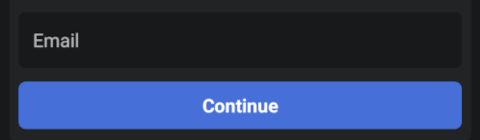

# OwnID Compose Android SDK

The OwnID Android SDK is a client library offering a secure and passwordless login alternative for your Android applications. It leverages [Passkeys](https://www.passkeys.com) to replace conventional passwords, fostering enhanced authentication methods.

The OwnID Compose Android SDK extends [OwnID Android Core SDK](../README.md) and provides [Android Compose](https://developer.android.com/jetpack/compose) wrapper for OwnID UI widgets and convenient way to access OwnID ViewModels. 

For more general information about OwnID SDKs, see [OwnID Android SDK](../README.md).

## Table of contents

* [General notes](#general-notes)
* [Add Dependency to Gradle File](#add-dependency-to-gradle-file)
* [Implement the Registration Screen](#implement-the-registration-screen)
   + [Add OwnID UI](#add-ownid-ui)
   + [Listen to Events from OwnID Register View Model](#listen-to-events-from-ownid-register-view-model)
* [Implement the Login Screen](#implement-the-login-screen)
   + [Add OwnID UI](#add-ownid-ui-1)
   + [Listen to Events from OwnID Login View Model](#listen-to-events-from-ownid-login-view-model)
   + [Social Login and Account linking](#social-login-and-account-linking)
   
## General notes

The OwnID Compose Android SDK provides [Android Compose](https://developer.android.com/jetpack/compose) wrapper for OwnID UI widgets and OwnID ViewModels. It contains:
* `OwnIdLoginButton` - a Compose component with OwnID Login functionality (wraps `OwnIdButton` based on [AndroidView](https://developer.android.com/reference/kotlin/androidx/compose/ui/viewinterop/package-summary#AndroidView(kotlin.Function1,androidx.compose.ui.Modifier,kotlin.Function1))).
* `OwnIdRegisterButton` - a Compose component with OwnID Registration functionality (wraps `OwnIdButton` based on [AndroidView](https://developer.android.com/reference/kotlin/androidx/compose/ui/viewinterop/package-summary#AndroidView(kotlin.Function1,androidx.compose.ui.Modifier,kotlin.Function1))).
* `OwnIdLoginViewModel` and `OwnIdRegisterViewModel` - a convenient way to get OwnID ViewModels within composable components.

> [!IMPORTANT]
>
> OwnID Compose Android SDK provides only wrapper for OwnID UI widgets and OwnID ViewModels. To complete OwnID SDK integration, please follow OwnID Android SDK [documentation](../README.md). 

## Add Dependency to Gradle File

The OwnID Compose Android SDK is available from the Maven Central repository. As long as your app's `build.gradle` file includes `mavenCentral()` as a repository, you can include the OwnID SDK by adding the following to the Gradle file (the latest version is: [](https://github.com/OwnID/ownid-android-sdk)):

```groovy
implementation "com.ownid.android-sdk:compose:<latest version>"
```

The OwnID Compose Android SDK is built with Android API version 34 and Java 8+, and supports the minimum API version 23.

## Implement the Registration Screen

Using the OwnID Compose SDK to implement passwordless authentication starts by adding an `OwnIdRegisterButton` component to your Registration screen. Your app then waits for events while the user interacts with OwnID.

### Add OwnID UI

Add the passwordless authentication to your application's Registration screen by including the `OwnIdRegisterButton` component. Add the following to your Registration screen:

```kotlin
OwnIdRegisterButton(
    loginId = emailValue,
    onReadyToRegister = { ownIdEvent ->
       if (ownIdEvent.loginId.isNotBlank()) emailValue = ownIdEvent.loginId
    }
)
```
Check [complete example](../demo-gigya-compose/src/main/java/com/ownid/demo/gigya/ui/RegistrationScreen.kt)

 

`OwnIdRegisterButton` component wraps `OwnIdButton` and has such parameters:

* `loginId` - Current user Login ID (like email or phone number).
* `modifier` - The modifier to be applied to the `OwnIdRegisterButton`.
* `onReadyToRegister` - A callback function to be invoked when `OwnIdRegisterEvent.ReadyToRegister` event happens.
* `onUndo` - A callback function to be invoked when `OwnIdRegisterEvent.Undo` event happens.
* `ownIdViewModel` - An instance of `OwnIdRegisterViewModel`.
* `styleRes` - A style resource reference. Use it to style `OwnIdButton`

For additional UI customization, see [Button UI customization](sdk-advanced-configuration.md#button-ui-customization).

### Listen to Events from OwnID Register View Model

Now that you have added the OwnID UI to your screen, you need to listen to registration events that occur when the user interacts with OwnID. First, create an instance of `OwnIdRegisterViewModel` in your Fragment or Activity, passing in an OwnID instance as the argument:

```kotlin
class RegisterActivity : ComponentActivity() {
    private val ownIdRegisterViewModel: OwnIdRegisterViewModel by ownIdViewModel(<OwnId Instance>)
}
```

> [!NOTE]
>
> Note that `OwnIdRegisterViewModel` is always bound to Activity `viewModelStore`.

To listen to registration events, you have two options:
1. Listen within the Fragment or Activity. See [example](../demo-gigya-compose/src/main/java/com/ownid/demo/gigya/ui/activity/MainActivity.kt).
1. Listen within Compose tree using composable extension for `OwnIdRegisterViewModel`. See [example](../demo-gigya-compose/src/main/java/com/ownid/demo/gigya/ui/RegistrationScreen.kt#L85).

> [!IMPORTANT]
>
> The registration events types are depend on integration type you use in your app. Check *Listen to Events from OwnID Register View Model* section in documentation for OwnID integration type you use.

## Implement the Login Screen

The process of implementing your Login screen is very similar to the one used to implement the Registration screen - add an OwnId UI to your Login screen. Your app then waits for events while the user interacts with OwnID.

### Add OwnID UI

Similar to the Registration screen, add the passwordless authentication to your application's Login screen by including one of OwnID button variants:

1. Side-by-side button: The button that is located on the side of the password input field.
1. Password replacing button: The button that replaces password input field.

You can use any of this buttons based on your requirements. 

1. **Side-by-side button**

    Add the following to your Login screen's layout file:

    ```kotlin
    OwnIdLoginButton(
        loginIdProvider = { emailValue },
    )
    ```
    Check [complete example](../demo-gigya-compose/src/main/java/com/ownid/demo/gigya/ui/LoginScreen.kt)

     

    `OwnIdLoginButton` component wraps `OwnIdButton` and has such parameters:

    * `loginIdProvider` - A function that returns current user Login ID (like email or phone number) as string.
    * `modifier` - The modifier to be applied to the `OwnIdLoginButton`.
    * `loginType` - Login type. Default `OwnIdLoginType.Standard`. See [Social Login and Account linking](#social-login-and-account-linking) for details.
    * `ownIdViewModel` - An instance of `OwnIdLoginViewModel`.
    * `styleRes` - A style resource reference. Use it to style `OwnIdButton`

    For additional UI customization, see [Button UI customization](sdk-advanced-configuration.md#button-ui-customization).

1. **Password replacing button**

     Add the following to your Login screen's layout file:

    ```xml 
    OwnIdAuthLoginButton(
        loginIdProvider = { emailValue },
    )
    ```
    Check [complete example](../demo-gigya-compose/src/main/java/com/ownid/demo/gigya/ui/LoginAuthScreen.kt)

     

    `OwnIdAuthLoginButton` component wraps `OwnIdAuthButton` and has such parameters:

    * `loginIdProvider` - A function that returns current user Login ID (like email or phone number) as string.
    * `modifier` - The modifier to be applied to the `OwnIdAuthLoginButton`.
    * `loginType` - Login type. Default `OwnIdLoginType.Standard`. See [Social Login and Account linking](#social-login-and-account-linking) for details.
    * `ownIdViewModel` - An instance of `OwnIdLoginViewModel`.
    * `styleRes` - A style resource reference. Use it to style `OwnIdAuthButton`

    For additional UI customization, see [Button UI customization](sdk-advanced-configuration.md#button-ui-customization).

### Listen to Events from OwnID Login View Model

Now that you have added the OwnID UI to your screen, you need to listen to login events that occur as the user interacts with OwnID. First, create an instance of `OwnIdLoginViewModel` in your Fragment or Activity, passing in an OwnID instance as the argument:

```kotlin
class LoginActivity : ComponentActivity() {
    private val ownIdLoginViewModel: OwnIdLoginViewModel by ownIdViewModel(<OwnId Instance>)
}
```

> [!NOTE]
>
> Note that `OwnIdLoginViewModel` is always bound to Activity `viewModelStore`.

To listen to login events you have two options:
1. Listen within the Fragment or Activity.  See [example](../demo-gigya-compose/src/main/java/com/ownid/demo/gigya/ui/activity/MainActivity.kt).
1. Listen within Compose tree using composable extension for `OwnIdLoginViewModel`. See [example](../demo-gigya-compose/src/main/java/com/ownid/demo/gigya/ui/LoginScreen.kt#L62).

> [!IMPORTANT]
>
> The login events types are depend on integration type you use in your app. Check *Listen to Events from OwnID Login View Model* section in documentation for OwnID integration type you use.

### Social Login and Account linking

If you use Gigya [Social Login](https://github.com/SAP/gigya-android-sdk/tree/main/sdk-core#social-login) feature then you need to handle [Account linking interruption](https://github.com/SAP/gigya-android-sdk/tree/main/sdk-core#interruptions-handling---account-linking-example) case. To let OwnID do account linking add the `OwnIdLoginButton` or `OwnIdAuthLoginButton` component to your application's Account linking screen same as for Login screen and pass `OwnIdLoginType.LinkSocialAccount` as `loginType` parameter:

```kotlin
OwnIdLoginButton(
    loginIdProvider = { emailValue },
    loginType = OwnIdLoginType.LinkSocialAccount,
)
```