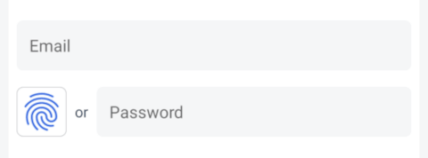

# OwnID Compose Android SDK

The OwnID Android SDK is a client library offering a secure and passwordless login alternative for your Android applications. It leverages [Passkeys](https://www.passkeys.com) to replace conventional passwords, fostering enhanced authentication methods.

The OwnID Compose Android SDK extends [OwnID Android Core SDK](../README.md) and provides [Android Compose](https://developer.android.com/jetpack/compose) wrapper for OwnID UI widgets and convenient way to access OwnID ViewModels. 

For more general information about OwnID SDKs, see [OwnID Android SDK](../README.md).

## Table of contents

* [General notes](#general-notes)
* [Add Dependency to Gradle File](#add-dependency-to-gradle-file)
* [Implement the Registration Screen](#implement-the-registration-screen)
   + [Add OwnID UI](#add-ownid-ui)
   + [OwnIdIntegration Component is Set](#a-ownidintegration-component-is-set)
   + [OwnIdIntegration Component is Not Set](#b-ownidintegration-component-is-not-set)
* [Implement the Login Screen](#implement-the-login-screen)
   + [Add OwnID UI](#add-ownid-ui-1)
   + [OwnIdIntegration Component is Set](#a-ownidintegration-component-is-set-1)
   + [OwnIdIntegration Component is Not Set](#b-ownidintegration-component-is-not-set-1)
   + [Social Login and Account linking](#social-login-and-account-linking)
* [Credential enrollment](#credential-enrollment)

## General notes

The OwnID Compose Android SDK provides [Android Compose](https://developer.android.com/jetpack/compose) wrapper for OwnID UI widgets and OwnID ViewModels. It contains:
* `OwnIdLoginButton` - a Compose component with OwnID Login functionality (wraps `OwnIdButton` based on [AndroidView](https://developer.android.com/reference/kotlin/androidx/compose/ui/viewinterop/package-summary#AndroidView(kotlin.Function1,androidx.compose.ui.Modifier,kotlin.Function1))).
* `0wnIdRegisterButton` - a Compose component with OwnID Registration functionality (wraps `OwnIdButton` based on [AndroidView](https://developer.android.com/reference/kotlin/androidx/compose/ui/viewinterop/package-summary#AndroidView(kotlin.Function1,androidx.compose.ui.Modifier,kotlin.Function1))).
* `ownIdLoginViewModel` and `ownIdRegisterViewModel` - a convenient way to get OwnID ViewModels within composable components.

> [!IMPORTANT]
>
> OwnID Compose Android SDK provides only wrapper for OwnID UI widgets and OwnID ViewModels. To complete OwnID SDK integration, please follow OwnID Android SDK [documentation](../README.md). 

## Add Dependency to Gradle File

The OwnID Compose Android SDK is available from the Maven Central repository. As long as your app's `build.gradle` file includes `mavenCentral()` as a repository, you can include the OwnID SDK by adding the following to the Gradle file (the latest version is: [](https://search.maven.org/artifact/com.ownid.android-sdk/compose)):

```groovy
implementation "com.ownid.android-sdk:compose:<latest version>"
```

The OwnID Compose Android SDK is built with Android API version 35 and Java 8+, and supports the minimum API version 23.

## Implement the Registration Screen

Using the OwnID Compose SDK to implement passwordless authentication starts by adding an `OwnIdRegisterButton` component to your Registration screen. Your app then waits while the user interacts with OwnID.

### Add OwnID UI

Integrate passwordless authentication into your application's Registration screen by including the `OwnIdRegisterButton` component. Depending on whether the `OwnIdIntegration` component is set in `OwnIdInstance` used by `OwnIdRegisterViewModel`, there are two options:

#### A. OwnIdIntegration Component is Set

Add the following code to your Registration screen:

```kotlin
val ownIdRegisterViewModel = ownIdViewModel<OwnIdRegisterViewModel>()

OwnIdRegisterButton(
    loginId = emailValue,
    ownIdRegisterViewModel = ownIdRegisterViewModel,
    onReadyToRegister = { loginId ->
        // (Optional) Set the actual login id that was used in OwnID flow into your registration UI 
        if (loginId.isNotBlank()) emailValue = loginId 
    },
    onLogin = { /* User is logged in with OwnID. */ },
    onError = { error -> /* Handle 'error' according to your application flow. */ }
)
```

Update your **Create Account** button or equivalent to complete registration with OwnID if the user finished OwnID registration flow:

```kotlin
Button(
    onClick = {
        if (ownIdRegisterViewModel.isReadyToRegister) {
            // Register user with OwnID.
            // The exact parameters depend on the type of integration you use. Check OwnID documentation.
            ownIdRegisterViewModel.register(emailValue, ...)
        } else {
            // Register user with a password.
        }
    }
) {
   Text(text = "Create Account")
}
```

Check [complete example](../demo/gigya/src/main/java/com/ownid/demo/gigya/screen/auth/RegistrationScreen.kt#L93).

#### B. OwnIdIntegration Component is Not Set

Add the following code to your Registration screen:

```kotlin
OwnIdRegisterButton(
    loginId = emailValue,
    onResponse = { response -> 
        when (response.payload.type) { 
            OwnIdPayload.Type.Registration -> { 
                if (response.loginId.isNotBlank()) {
                    // (Optional) Set the actual login id that was used in OwnID flow into your registration UI
                }

                // 1. Collect any additional registration data from the user.
                // 2. On the Create Account button click, register the user with your identity platform and 
                //    set OwnId Data (response.payload.data) to the user's profile.
            }

            OwnIdPayload.Type.Login -> { 
                // Login the user with your identity platform using data from this event (response.payload.data).
            }
        }
    },
    onError = { error -> /* Handle 'error' according to your application flow. */ }
)
```

 

`OwnIdRegisterButton` component wraps `OwnIdButton` and has the following parameters:
   * `loginId` - Current user login id (e.g., email or phone number).
   * `modifier` - (optional) The modifier to be applied to the `OwnIdRegisterButton`.
   * `ownIdRegisterViewModel` - (optional) An instance of `OwnIdRegisterViewModel`.
   * `onReadyToRegister` - (optional) A function called when the user successfully completes OwnID registration flow.
   * `onLogin` - (optional) A function called when the user successfully completes registration with OwnID and is logged in with OwnID.
   * `onResponse` - (optional) A function called at the end of the successful OwnID registration flow with `OwnIdFlowResponse`.
   * `onError` -  (optional) A function called when an error occurs during the OwnID registration process, with `OwnIdException`.
   * `onUndo` - (optional) A function called when the user selects the "Undo" option in the ready-to-register state.   
   * `onBusy` - (optional) A function called to notify the busy status during the OwnID registration process.
   * `styleRes` - A style resource reference. Use it to style `OwnIdButton`

> [!IMPORTANT]
>
> The set of functions that will be called depends on whether the `OwnIdIntegration` component is set in `OwnIdInstance` used by `OwnIdRegisterViewModel`:
> * If no `OwnIdIntegration` component is set, the functions `onResponse`, `onError`, `onUndo`, and `onBusy` will be called.
> * If the `OwnIdIntegration` component is set, the functions `onReadyToRegister`, `onLogin`, `onError`, `onUndo`, and `onBusy` will be called.

For additional UI customization, see [Button UI customization](sdk-advanced-configuration.md#button-ui-customization).

## Implement the Login Screen

The process of implementing your Login screen is very similar to the one used to implement the Registration screen - add an OwnId UI to your Login screen. Your app then waits while the user interacts with OwnID.

### Add OwnID UI

Similar to the Registration screen, add the passwordless authentication to your application's Login screen by including one of OwnID button variants:

1. Side-by-side button: The button that is located on the side of the password input field.
1. Password replacing button: The button that replaces password input field.

You can use any of this buttons based on your requirements.

Also, depending on whether the `OwnIdIntegration` component is set in `OwnIdInstance` used by `OwnIdRegisterViewModel`, there are two options:

#### A. OwnIdIntegration Component is Set

1. **Side-by-side button**

    Add the following to your Login screen's layout file:

    ```kotlin
    OwnIdLoginButton(
        loginIdProvider = { emailValue },
        onLogin = { /* User is logged in with OwnID. */ },
        onError = { error -> /* Handle 'error' according to your application flow. */ }
    )
    ```
    Check [complete example](../demo/gigya/src/main/java/com/ownid/demo/gigya/screen/auth/LoginScreen.kt#L94)

1. **Password replacing button**

     Add the following to your Login screen's layout file:

    ```xml 
    OwnIdAuthLoginButton(
        loginIdProvider = { emailValue },
        onLogin = { /* User is logged in with OwnID. */ },
        onError = { error -> /* Handle 'error' according to your application flow. */ }
    )
    ```
    Check [complete example](../demo/gigya/src/main/java/com/ownid/demo/gigya/screen/auth/LoginScreen.kt#L147)
  
#### B. OwnIdIntegration Component is Not Set

1. **Side-by-side button**

    Add the following to your Login screen's layout file:

    ```kotlin
    OwnIdLoginButton(
        loginIdProvider = { emailValue },
        onResponse = { response -> 
            // Login user with your identity platform using data from response (response.payload.data)
        },
        onError = { error -> /* Handle 'error' according to your application flow. */ }
    )
    ```

1. **Password replacing button**

     Add the following to your Login screen's layout file:

    ```kotlin 
    OwnIdAuthLoginButton(
        loginIdProvider = { emailValue },
        onResponse = { response -> 
            // Login user with your identity platform using data from response (response.payload.data)
        },
        onError = { error -> /* Handle 'error' according to your application flow. */ }
    )
    ```

**Side-by-side button:**

 

`OwnIdLoginButton` component wraps `OwnIdButton` and has such parameters:
   * `loginIdProvider` - A function returning the current user login id (e.g., email or phone number).
   * `modifier` - (optional) The modifier to be applied to the `OwnIdLoginButton`.
   * `ownIdLoginViewModel` - (optional) An instance of [OwnIdLoginViewModel].
   * `loginType` - (optional) Login type. Default `OwnIdLoginType.Standard`. See [Social Login and Account linking](#social-login-and-account-linking) for details.
   * `onLogin` - (optional) A function called when the user successfully completes login with OwnID.
   * `onResponse` - (optional) A function called at the end of the successful OwnID login flow with `OwnIdFlowResponse`.
   * `onError` -  (optional) A function called when an error occurs during the OwnID login process, with `OwnIdException`.
   * `onBusy` - (optional) A function called to notify the busy status during the OwnID login process.
   * `styleRes` - A style resource reference. Use it to style `OwnIdButton`

For additional UI customization, see [Button UI customization](sdk-advanced-configuration.md#button-ui-customization).

**Password replacing button:**

 

`OwnIdAuthLoginButton` component wraps `OwnIdAuthButton` and has such parameters:
   * `loginIdProvider` - A function returning the current user login id (e.g., email or phone number).
   * `modifier` - (optional) The modifier to be applied to the `OwnIdLoginButton`.
   * `ownIdLoginViewModel` - (optional) An instance of [OwnIdLoginViewModel].
   * `loginType` - (optional) Login type. Default `OwnIdLoginType.Standard`. See [Social Login and Account linking](#social-login-and-account-linking) for details.
   * `onLogin` - (optional) A function called when the user successfully completes login with OwnID.
   * `onResponse` - (optional) A function called at the end of the successful OwnID login flow with `OwnIdFlowResponse`.
   * `onError` -  (optional) A function called when an error occurs during the OwnID login process, with `OwnIdException`.
   * `onBusy` - (optional) A function called to notify the busy status during the OwnID login process.
   * `styleRes` - A style resource reference. Use it to style `OwnIdAuthButton`

For additional UI customization, see [Button UI customization](sdk-advanced-configuration.md#button-ui-customization).

> [!IMPORTANT]
>
> The set of functions that will be called depends on whether the `OwnIdIntegration` component is set in `OwnIdInstance` used by `OwnIdRegisterViewModel`:
> * If no `OwnIdIntegration` component is set, the functions `onResponse`, `onError`, and `onBusy` will be called.
> * If the `OwnIdIntegration` component is set, the functions `onLogin`, `onError`, and `onBusy` will be called.

### Social Login and Account linking

If you use Gigya [Social Login](https://github.com/SAP/gigya-android-sdk/tree/main/sdk-core#social-login) feature then you need to handle [Account linking interruption](https://github.com/SAP/gigya-android-sdk/tree/main/sdk-core#interruptions-handling---account-linking-example) case. To let OwnID do account linking add the `OwnIdLoginButton` or `OwnIdAuthLoginButton` component to your application's Account linking screen same as for Login screen and pass `OwnIdLoginType.LinkSocialAccount` as `loginType` parameter:

```kotlin
OwnIdLoginButton(
    loginIdProvider = { emailValue },
    loginType = OwnIdLoginType.LinkSocialAccount,
    ...
)
```

## Credential enrollment

The credential enrollment feature enables users to enroll credentials outside of the login/registration flows. You can trigger credential enrollment on demand, such as after the user registers with a password.

To trigger credential enrollment, create an instance of `OwnIdEnrollmentViewModel` and call the `enrollCredential` method:

```kotlin
val context = LocalContext.current
val ownIdEnrollmentViewModel = ownIdViewModel<OwnIdEnrollmentViewModel>()

ownIdEnrollmentViewModel.enrollCredential(
    context = context,
    loginIdProvider = ...,
    authTokenProvider = ...
)
```

The `enrollCredential` method requires `loginIdProvider` and `authTokenProvider` functions:
 - `loginIdProvider`: A function that provides the user's login ID. This function should invoke the provided `OwnIdCallback<String>` with the login ID.
 - `authTokenProvider`: A function that provides the user's authentication token. It should invoke the provided `OwnIdCallback<String>` with the authentication token.

```kotlin
/**
 * Type alias for OwnID SDK callback.
 * Called when operation completed with a [Result] value.
 * **Important:** Always called on Main thread.
 */
public typealias OwnIdCallback<T> = Result<T>.() -> Unit
```` 

If you use the OwnID Gigya Android SDK, you can utilize the provided default implementations `OwnIdGigya.defaultLoginIdProvider()` and `OwnIdGigya.defaultAuthTokenProvider()`, respectively.

Optionally, to monitor the status of the last credential enrollment request, you can listen to enrollment events from the StateFlow via `OwnIdEnrollmentViewModel.enrollmentResultFlow`:

```kotlin
val enrollmentResult = ownIdEnrollmentViewModel.enrollmentResultFlow.collectAsStateWithLifecycle()
LaunchedEffect(enrollmentResult.value) {
    Log.i("UserActivity", "enrollmentResult: ${enrollmentResult.value}")
}
```