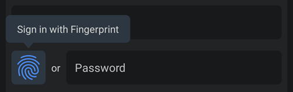

# OwnID Core Android SDK - Custom Integration
The OwnID Core Android SDK describes the way to integrate and use OwnID with your identity platform.

The OwnID Android SDK is a client library written in Kotlin that provides a passwordless login alternative for your Android application by using [Passkeys](https://www.passkeys.com/) to replace the traditional password. The SDK is packaged as an Android library (.aar) that is available from the Maven Central repository. For more general information about OwnID SDKs, see [OwnID Android SDK](../README.md).

## Table of contents
* [Before You Begin](#before-you-begin)
* [Add Dependency to Gradle File](#add-dependency-to-gradle-file)
* [Enable Java 8 Compatibility in Your Project](#enable-java-8-compatibility-in-your-project)
* [Enable passkey authentication](#enable-passkey-authentication)
* [Create Configuration File](#create-configuration-file)
* [Create OwnID Integration](#create-ownid-integration)
* [Create OwnID Instance](#create-ownid-instance)
* [Implement the Registration Screen](#implement-the-registration-screen)
   + [Add OwnID UI](#add-ownid-ui)
   + [Listen to Events from OwnID Register View Model](#listen-to-events-from-ownid-register-view-model)
      - [Calling the register() Function](#calling-the-register-function)
* [Implement the Login Screen](#implement-the-login-screen)
   + [Add OwnID UI](#add-ownid-ui-1)
   + [Listen to Events from OwnID Login View Model](#listen-to-events-from-ownid-login-view-model)
* [Tooltip](#tooltip)
* [Error and Exception Handling](#error-and-exception-handling)
* [Advanced Configuration](#advanced-configuration)
   + [Logging Events](#logging-events)
   + [OwnID environment](#ownid-environment)
   + [OwnID SDK language](#ownid-sdk-language)
   + [Redirection URI Alternatives](#redirection-uri-alternatives)
   + [Creating OwnID Instance](#creating-ownid-instance)
   + [Provide Login ID to OwnID](#provide-login-id-to-ownid)
   + [Button UI customization](#button-ui-customization)
   + [Custom view](#custom-view)

---

## Before You Begin
Before incorporating OwnID into your Android app, you need to create an OwnID application and integrate it with your identity platform. For details, see [OwnID documentation](https://docs.ownid.com/introduction).

## Add Dependency to Gradle File
The OwnID Core Android SDK is available from the Maven Central repository. As long as your app's `build.gradle` file includes `mavenCentral()` as a repository, you can include the OwnID SDK by adding the following to the Gradle file (the latest version is: [](https://github.com/OwnID/ownid-android-sdk)):
```groovy
implementation "com.ownid.android-sdk:core:<latest version>"
```
The OwnID Core Android SDK is built with Android API version 34 and Java 8+, and supports the minimum API version 23.

## Enable Java 8 Compatibility in Your Project
The OwnID SDK requires [Java 8 bytecode](https://developer.android.com/studio/write/java8-support). To enable this feature, add the following to your Gradle file:

```groovy
android {
   compileOptions {
      sourceCompatibility JavaVersion.VERSION_1_8
      targetCompatibility JavaVersion.VERSION_1_8
   }
   kotlinOptions {
      jvmTarget = "1.8"
   }
}
```

## Enable passkey authentication
The OwnID SDK uses passkeys to authenticate users. To enable passkey support for your Android app, associate your app with a website that your app owns using [Digital Asset Links](https://developers.google.com/digital-asset-links) by following this guide: [Add support for Digital Asset Links](https://developer.android.com/training/sign-in/passkeys#add-support-dal).

## Create Configuration File
The OwnID SDK uses a configuration file in your `assets` folder to configure itself. At a minimum, this JSON configuration file defines the OwnID App Id - the unique identifier of your OwnID application, which you can obtain from the [OwnID Console](https://console.ownid.com). Create `assets/ownIdIntegrationSdkConfig.json` and define the `appId` parameter:
```json
{
   "appId": "gephu342dnff2v"
}
```

For additional configuration options, including logging and UI language, see [Advanced Configuration](#advanced-configuration).

## Create OwnID Integration
To create interaction you have to create Kotlin or Java class (for example `OwnIdIntegration`), make it implement `OwnIdInstance` interface and implement `register` and `login` methods. You can use this template:

See [complete example](../demo-integration/src/main/java/com/ownid/demo/integration/OwnIdIntegration.kt)

```kotlin
class OwnIdIntegration(
    override val ownIdCore: OwnIdCore,
    private val identityPlatform: IdentityPlatform
) : OwnIdInstance {

    // Registration parameters in addition to user Login ID (optional)
    class IntegrationRegistrationParameters(val name: String) : RegistrationParameters

    override fun register(
        loginID: String, params: RegistrationParameters?, ownIdResponse: OwnIdResponse, callback: OwnIdCallback<Unit>
    ) {
        // Get registration parameters (optional)
        val name = (params as? IntegrationRegistrationParameters)?.name ?: ""

        // Generate random password
        val password = ownIdCore.generatePassword(16)

        val ownIdData = ownIdResponse.payload.data

        // TODO Add code that registers user in your identity platform and set OwnID Data to user profile.
        // On registration success call: callback(Result.success(Unit))
        // on registration failure call: callback(Result.failure(cause /* registration error */))
    }

    override fun login(ownIdResponse: OwnIdResponse, callback: OwnIdCallback<Unit>) {
        val data = ownIdResponse.payload.data

        // TODO Add code that log in user in your identity platform using data
        // On login success call: callback(Result.success(Unit))
        // on login failure call: callback(Result.failure(cause /* login error */))
    }

    companion object {
         @JvmStatic
         val INSTANCE_NAME: InstanceName = InstanceName("OwnIdIntegration")

         const val CONFIGURATION_FILE: String = "ownIdIntegrationSdkConfig.json"

         const val PRODUCT_NAME_VERSION: ProductName = "OwnIDIntegration/3.0.0"
     }
}
```

## Create OwnID Instance
Before adding OwnID UI to your app screens, you need to use an Android Context and instance of your identity platform to create an instance of OwnID.

See [complete example](../demo-integration/src/main/java/com/ownid/demo/integration/DemoApp.kt)

```kotlin
class MyApplication : Application() {
   override fun onCreate() {
      super.onCreate()

      val identityPlatform = ... // Create instance of your identity platform

      // Create instance of OwnIdIntegration
      OwnId.createInstanceFromFile(
            applicationContext, OwnIdIntegration.CONFIGURATION_FILE, OwnIdIntegration.PRODUCT_NAME_VERSION, OwnIdIntegration.INSTANCE_NAME
        ) { ownIdCore ->
            OwnIdIntegration(ownIdCore, identityPlatform)
        }
   }
}
```

The OwnID SDK reads the `ownIdIntegrationSdkConfig.json` configuration file from your `assets` folder and creates an instance that is accessible as `OwnId.getInstanceOrThrow(OwnIdIntegration.INSTANCE_NAME)`. For details about additional customization see [Creating OwnID Instance](#creating-ownid-instance).

## Implement the Registration Screen
Using the OwnID SDK to implement passwordless authentication starts by adding an `OwnIdButton` view to your Registration screen's layout file. Your app then waits for events while the user interacts with OwnID.

### Add OwnID UI

Add the passwordless authentication to your application's Registration screen by including the `OwnIdButton` view to your Registration screen's layout file:

```xml
<com.ownid.sdk.view.OwnIdButton
    android:id="@+id/own_id_register"
    android:layout_width="wrap_content"
    android:layout_height="0dp"
    app:loginIdEditText="@id/et_fragment_create_email" />
```
Check [complete example](../demo-integration/src/main/res/layout/fragment_create.xml)

 

`OwnIdButton` is an Android [ConstraintLayout](https://developer.android.com/reference/androidx/constraintlayout/widget/ConstraintLayout) view that contains OwnID button - customized [ImageView](https://developer.android.com/reference/android/widget/ImageView) and [TextView](https://developer.android.com/reference/android/widget/TextView) with "or" text. The OwnID button ImageView is always square in size, recommended to use height to not less `40dp`. It's recommended to use [ConstraintLayout](https://developer.android.com/training/constraint-layout) and position `OwnIdButton` to the start on password EditText with top constraint set to the top and bottom to the bottom of Password EditText. If you want to put `OwnIdButton` to the end on password EditText, set attribute `app:widgetPosition="end"` for `OwnIdButton`.

Define the `loginIdEditText` attribute to reference the [EditText](https://developer.android.com/reference/android/widget/EditText) widget that correspond to the Login ID field of your Registration screen. Including these attribute simplifies the way the SDK obtains the user's Login ID. If you want your code to provide the user's Login ID to the SDK instead of using the view attribute, see [Provide Login ID to OwnID](#provide-login-id-to-ownid).

For additional `OwnIdButton` UI customization see [Button UI customization](#button-ui-customization).

### Listen to Events from OwnID Register View Model
Now that you have added the OwnID UI to your screen, you need to listen to registration events that occur when the user interacts with OwnID. First, create an instance of `OwnIdRegisterViewModel` in your Fragment or Activity, passing in an `OwnIdIntegration` instance as the argument:

```kotlin
class MyRegistrationFragment : Fragment() {
    private val ownIdIntegration: OwnIdIntegration = OwnId.getInstanceOrThrow(OwnIdIntegration.INSTANCE_NAME)
    private val ownIdViewModel: OwnIdRegisterViewModel by ownIdViewModel(ownIdIntegration)
}
```

Within that Fragment or Activity, insert code that attaches a `OwnIdButton` view to the `OwnIdRegisterViewMode` and listens to OwnID Register events:

See [complete example](../demo-integration/src/main/java/com/ownid/demo/integration/ui/fragment/CreateFragment.kt)

```kotlin
class MyRegistrationFragment : Fragment() {
    
    private val ownIdIntegration: OwnIdIntegration = OwnId.getInstanceOrThrow(OwnIdIntegration.INSTANCE_NAME)
    private val ownIdViewModel: OwnIdRegisterViewModel by ownIdViewModel(ownIdIntegration)

    override fun onViewCreated(view: View, savedInstanceState: Bundle?) {
        super.onViewCreated(view, savedInstanceState)

        ownIdViewModel.attachToView(view.findViewById(R.id.own_id_register))

        ownIdViewModel.events.observe(viewLifecycleOwner) { ownIdEvent ->
            when (ownIdEvent) {
                // Event when OwnID is busy processing request
                is OwnIdRegisterEvent.Busy -> { /* (Optional) Show busy status 'ownIdEvent.isBusy' according to your application UI */  }
                
                // Event when user successfully finishes OwnID registration flow
                is OwnIdRegisterEvent.ReadyToRegister -> {
                    // Obtain user's Login ID before calling the register() function.
                    ownIdViewModel.register(loginId)
                    // or 
                    // ownIdViewModel.register(loginId, OwnIdIntegration.IntegrationRegistrationParameters(name))
                }

                // Event when user select "Undo" option in ready-to-register state
                OwnIdRegisterEvent.Undo -> { /* */}

                // Event when OwnID creates account and logs in user
                is OwnIdRegisterEvent.LoggedIn -> { /* User is logged in with OwnID. Use 'ownIdEvent.authType' to get type of authentication that was used during OwnID flow.*/ }

                // Event when an error happened during OwnID flow 
                is OwnIdRegisterEvent.Error -> {
                    // Handle error 'ownIdEvent.cause' according to your application flow
                }
            }
        }
    }
}
```

#### Calling the register() Function
The OwnID `OwnIdRegisterViewModel.register()` function must be called in response to the `ReadyToRegister` event. You can define additional parameters for the registration request as `class IntegrationRegistrationParameters(...): RegistrationParameters` and pass it to `ownIdViewModel.register(loginId, IntegrationRegistrationParameters(...))`.

## Implement the Login Screen
The process of implementing your Login screen is very similar to the one used to implement the Registration screen - add an OwnId UI to your Login screen. Your app then waits for events while the user interacts with OwnID.

### Add OwnID UI

Similar to the Registration screen, add the passwordless authentication to your application's Login screen by including one of OwnID button variants:

1. Side-by-side button: The `OwnIdButton` that is located on the side of the password input field.
2. Password replacing button: The `OwnIdAuthButton` that replaces password input field.

You can use any of this buttons based on your requirements. 

1. **Side-by-side button**

    Add the following to your Login screen's layout file:

    ```xml
    <com.ownid.sdk.view.OwnIdButton
        android:id="@+id/own_id_login"
        android:layout_width="wrap_content"
        android:layout_height="0dp"
        app:loginIdEditText="@id/et_fragment_login_email" />
    ```
    Check [complete example](../demo-integration/src/main/res/layout/fragment_login.xml)

     

    `OwnIdButton` is an Android [ConstraintLayout](https://developer.android.com/reference/androidx/constraintlayout/widget/ConstraintLayout) view that contains OwnID button - customized [ImageView](https://developer.android.com/reference/android/widget/ImageView) and [TextView](https://developer.android.com/reference/android/widget/TextView) with "or" text. The OwnID button ImageView is always square in size, recommended to use height to not less `40dp`. It's recommended to use [ConstraintLayout](https://developer.android.com/training/constraint-layout) and put `OwnIdButton` to the end on password EditText with top constraint set to the top and bottom to the bottom of Password EditText.

    Define the `loginIdEditText` attribute to reference the [EditText](https://developer.android.com/reference/android/widget/EditText) widget that correspond to the Login ID field of your Login screen. Including these attribute simplifies the way the SDK obtains the user's Login ID. If you want your code to provide the user's Login ID to the SDK instead of using the view attribute, see [Provide Login ID to OwnID](#provide-login-id-to-ownid).

    For additional `OwnIdButton` UI customization see [Button UI customization](#button-ui-customization).

1. **Password replacing button**

     Add the following to your Login screen's layout file:

    ```xml
    <com.ownid.sdk.view.OwnIdAuthButton
        android:id="@+id/own_id_login"
        android:layout_width="0dp"
        android:layout_height="wrap_content"
        app:loginIdEditText="@id/et_fragment_login_email" />
    ```

     

    `OwnIdAuthButton` is an Android [ConstraintLayout](https://developer.android.com/reference/androidx/constraintlayout/widget/ConstraintLayout) view that contains OwnID button - customized [MaterialButton](https://developer.android.com/reference/com/google/android/material/button/MaterialButton) and [CircularProgressIndicator](https://developer.android.com/reference/com/google/android/material/progressindicator/CircularProgressIndicator). It's recommended to use [ConstraintLayout](https://developer.android.com/training/constraint-layout) and position `OwnIdAuthButton` below Login ID EditText with start and end constraint set to the start and end of Login ID EditText.

    Define the `loginIdEditText` attribute to reference the [EditText](https://developer.android.com/reference/android/widget/EditText) widget that correspond to the Login ID field of your Registration screen. Including these attribute simplifies the way the SDK obtains the user's Login ID. If you want your code to provide the user's Login ID to the SDK instead of using the view attribute, see [Provide Login ID to OwnID](#provide-login-id-to-ownid).

    For additional `OwnIdAuthButton` UI customization see [Button UI customization](#button-ui-customization).

### Listen to Events from OwnID Login View Model
Now that you have added the OwnID UI to your screen, you need to listen to login events that occur as the user interacts with OwnID. First, create an instance of `OwnIdLoginViewModel` in your Fragment or Activity, passing in an `OwnIdIntegration` instance as the argument:

```kotlin
class MyLoginFragment : Fragment() {
    private val ownIdIntegration: OwnIdIntegration = OwnId.getInstanceOrThrow(OwnIdIntegration.INSTANCE_NAME)
    private val ownIdViewModel: OwnIdLoginViewModel by ownIdViewModel(ownIdIntegration)
}
```

Within that Fragment or Activity, insert code that attaches a `OwnIdButton` view to the `OwnIdLoginViewModel` and listens to OwnID Login events:

See [complete example](../demo-integration/src/main/java/com/ownid/demo/integration/ui/fragment/LoginFragment.kt)

```kotlin
class MyLoginFragment : Fragment() {
    
    private val ownIdIntegration: OwnIdIntegration = OwnId.getInstanceOrThrow(OwnIdIntegration.INSTANCE_NAME)
    private val ownIdViewModel: OwnIdLoginViewModel by ownIdViewModel(ownIdIntegration)

    override fun onViewCreated(view: View, savedInstanceState: Bundle?) {
        super.onViewCreated(view, savedInstanceState)

        ownIdViewModel.attachToView(view.findViewById(R.id.own_id_login))

        ownIdViewModel.events.observe(viewLifecycleOwner) { ownIdEvent ->
            when (ownIdEvent) {
                // Event when OwnID is busy processing request
                is OwnIdLoginEvent.Busy -> { /* (Optional) Show busy status 'ownIdEvent.isBusy' according to your application UI */  }
                
                // Event when OwnID logs in user
                is OwnIdLoginEvent.LoggedIn -> { /* User is logged in with OwnID. Use 'ownIdEvent.authType' to get type of authentication that was used during OwnID flow.*/ }

                is OwnIdLoginEvent.Error -> { /* Handle 'ownIdEvent.cause' according to your application flow */ }
            }
        }
    }
}
```

## Tooltip
The OwnID SDK's `OwnIdButton` by default shows a Tooltip with text "Login with Fingerprint". The OwnID Tooltip view is attached to `OwnIdButton` view lifecycle. For login the Tooltip appears every time the `OwnIdButton` view is `onResume` state and hides on `onPause` state. For registration the Tooltip appears when Login ID "EditText" view contains valid Login ID address, and follows the same `onResume`/`onPause` state logic.

 

`OwnIdButton` view has parameters to specify tooltip text appearance, tooltip background color (default value `#FFFFFF`, default value-night: `#2A3743`), tooltip border color (default value `#D0D0D0`, default value-night: `#2A3743`) and tooltip position `top`/`bottom`/`start`/`end`/`none` (default `bottom`). You can change them by setting values in view attributes:

```xml
<com.ownid.sdk.view.OwnIdButton
    app:tooltipTextAppearance="@style/OwnIdButton.TooltipTextAppearance.Default"
    app:tooltipBackgroundColor="@color/com_ownid_sdk_color_tooltip_background"
    app:tooltipBorderColor="@color/com_ownid_sdk_color_tooltip_border"
    app:tooltipPosition="bottom"/>
```

or via `style` attribute. First defile a style:

```xml
<resources>
    <style name="OwnIdButton.TooltipTextAppearance.Default" parent="@style/TextAppearance.AppCompat" />

    <style name="OwnIdButton.Custom" parent="">
        <item name="tooltipTextAppearance">@style/OwnIdButton.TooltipTextAppearance.Default</item>
        <item name="tooltipBackgroundColor">@color/com_ownid_sdk_color_tooltip_background</item>
        <item name="tooltipBorderColor">@color/com_ownid_sdk_color_tooltip_border</item>
        <item name="tooltipPosition">bottom</item>
    </style>
</resources>
```

and then set it in view attribute:

```xml
<com.ownid.sdk.view.OwnIdButton
    style="@style/OwnIdButton.Custom" />
```

## Error and Exception Handling
The OwnID SDK provides special classes that you can use to add error and exception handling to your application.

The general `OwnIdException` class represents top-level class for errors and exceptions that may happen in the flow of the OwnID SDK. The following is its definition:
```kotlin
/**
 * General exception used by OwnID SDK.
 *
 * There are three types of errors that are inherited from [OwnIdException]:
 *  - [OwnIdFlowCanceled] - Error when OwnID flow was canceled by user.
 *  - [OwnIdUserError] - Error that is intended to be reported to the user.
 *  - [OwnIdIntegrationError] - Error that wraps Identity Management System errors OwnID integrates with.
 *
 * @param message   Text message describing reason for exception.
 * @param cause     Original exception that is wrapped in [OwnIdException].
 */
class OwnIdException (message: String, cause: Throwable? = null) : Exception(message, cause)
```
In addition, the following classes are special exceptions that can occur in the flow of the OwnID SDK:
* `class OwnIdFlowCanceled(val step: String) : OwnIdException("User canceled OwnID ($step) flow.")` - Exception that occurs when user cancelled OwnID flow. Usually application can ignore this error.
* `class OwnIdUserError(val code: String, val userMessage: String, message: String, cause: Throwable? = null) : OwnIdException(message, cause)` - Error that is intended to be reported to end user. The `userMessage` string is localized based on [OwnID SDK language](#ownid-sdk-language) and can be used as an error message for user.
* `class OwnIdIntegrationError(message: String, cause: Throwable? = null) : OwnIdException(message, cause)` - General error for wrapping Identity Management Systems errors OwnID integrates with.

## Advanced Configuration

### Logging Events
OwnID SDK has a Logger that is used to log its events. The default OwnID Logger implementation, `OwnIdLogger.DefaultLogger()`, simply relays logs to `android.util.Log`.
To use a custom Logger, implement the `OwnIdLogger.Logger` interface, then specify your custom logger class instance and/or custom tag using the `init` method:

```kotlin
OwnIdLogger.set("Custom-Tag", CustomLogger())
```

By default, logging is **disabled**. To enable logging, set `OwnIdLogger.enabled = true`. It is highly recommended that you disable logging in production builds.

Logging can also be enabled from the configuration file `assets/ownIdIntegrationSdkConfig.json` by adding the optional `enableLogging` parameter:

```json
{
  "appId": "gephu342dnff2v",
  "enableLogging": true
}
```

### OwnID environment
By default, the OwnID uses production environment for `appId` specified in configuration. You can set different environment. Possible options are: `uat` and `staging`. Use `env` key in configuration json to specify required non-production environment:

```json
{
  "appId": "gephu342dnff2v",
  "env": "uat"
}
```

### OwnID SDK language
By default, the OwnID SDK uses language TAGs list (well-formed [IETF BCP 47 language tag](https://developer.mozilla.org/en-US/docs/Web/HTTP/Headers/Accept-Language)) based on the device locales set by the user in the Android system for this application. You can override this behavior and set the OwnID SDK language TAGs list manually. There are two ways to do so:

1. Set language TAGs list Provider - function that returns the language TAGs list for the OwnID SDK.

   <details open>
   <summary>Kotlin</summary>

   ```kotlin
   OwnIdLoginViewModel.setLanguageTagsProvider { listOf("en") }
   // or
   OwnIdRegisterViewModel.setLanguageTagsProvider { listOf("en") }
   ```
   </details>

   <details>
   <summary>Java</summary>

   ```java
   OwnIdLoginViewModel.setLanguageTagsProvider(() -> Collections.singletonList("en"));
   // or
   OwnIdRegisterViewModel.setLanguageTagsProvider(() -> Collections.singletonList("en"));
   ```
   </details>

2. Set language TAGs list directly:

   <details open>
   <summary>Kotlin</summary>

   ```kotlin
   OwnIdLoginViewModel.setLanguageTags(listOf("en"))
   // or
   OwnIdRegisterViewModel.setLanguageTags(listOf("en"))
   ```
   </details>

   <details>
   <summary>Java</summary>

   ```java
   OwnIdLoginViewModel.setLanguageTags(Collections.singletonList("en"));
   // or
   OwnIdRegisterViewModel.setLanguageTags(Collections.singletonList("en"));
   ```
   </details>

If more than one method of specifying the language TAGs is used, the SDK uses the following priority: the list from the Provider take precedence if it's not empty, then the language TAGs list is used if it's not empty, and then the list from device locales is used.

### Redirection URI Alternatives
**Important:** Redirection URI required only if OwnID flow uses OwnID Web App.

The redirection URI determines where the user lands once they are done using their browser to interact with the OwnID Web App. Because it needs to capture this redirect, the OwnID SDK must be registered with the Android OS as a handler of the URI. By default OwnID SDK uses redirection URI as `{applicationId}://ownid/redirect/` whereas the `applicationId` represents the [Android application Id](https://developer.android.com/studio/build/configure-app-module#set-application-id).
```xml
<activity
    android:name="com.ownid.sdk.internal.flow.steps.webapp.OwnIdWebAppRedirectActivity"
    android:exported="true"
    android:launchMode="singleTask">

    <intent-filter>
        <action android:name="android.intent.action.VIEW" />
        <category android:name="android.intent.category.DEFAULT" />
        <category android:name="android.intent.category.BROWSABLE" />
        <data
            android:host="ownid"
            android:path="/redirect/"
            android:scheme="${applicationId}" />
    </intent-filter>
</activity>
```
By doing so OwnID SDK assumes that the `applicationId` will match the value returned by [Context.getPackageName()](https://developer.android.com/reference/kotlin/android/content/Context#getpackagename). If the `applicationId` cannot be used as URI scheme ([see requirements](https://datatracker.ietf.org/doc/html/rfc3986#section-3.1)) an error message be in OwnID SDK logs (if logging is enabled): `Application package name (applicationId) cannot be used as URI scheme: https://datatracker.ietf.org/doc/html/rfc3986#section-3.1`. In this case, use custom redirection uri if your OwnID application is configured to use OwnID Web App flow.

If you want to avoid using a default redirection URI, you can add an intent-filter for `OwnIdWebAppRedirectActivity` with required custom url to your AndroidManifest.xml file:

```xml
<activity
    android:name="com.ownid.sdk.internal.flow.steps.webapp.OwnIdWebAppRedirectActivity"
    android:exported="true"
    android:launchMode="singleTask"
    tools:node="replace">

    <intent-filter>
        <action android:name="android.intent.action.VIEW"/>
        <category android:name="android.intent.category.DEFAULT"/>
        <category android:name="android.intent.category.BROWSABLE"/>
        <data
                android:host="myhost"
                android:scheme="com.myapp.demo" />
    </intent-filter>
</activity>
```
And specify this custom url in OwnID configuration with key `redirectUrl`:
```json
{
   "appId": "gephu342dnff2v",
   "redirectUrl": "com.myapp.demo://myhost"
}
```

In other cases, you might need to use an HTTPS redirection URI instead of a custom scheme. It is highly recommended that you secure HTTPS redirects by configuring the redirection URI as a verified [Android App Links](https://developer.android.com/training/app-links/index.html).

```xml
<activity
    android:name="com.ownid.sdk.internal.flow.steps.webapp.OwnIdWebAppRedirectActivity"
    android:exported="true"
    android:launchMode="singleTask"
    tools:node="replace">

    <intent-filter android:autoVerify="true">
        <action android:name="android.intent.action.VIEW"/>
        <category android:name="android.intent.category.DEFAULT"/>
        <category android:name="android.intent.category.BROWSABLE"/>
        <data android:scheme="https"
              android:host="demo.myapp.com"
              android:path="/ownid"/>
    </intent-filter>
</activity>
```

### Creating OwnID Instance
To create the OwnID instance you can use a function that reads a configuration file or use one that accepts a JSON string of configuration options directly. The following sections describe this process.

#### Option 1: Using Configuration File
You can use the `OwnId.createInstanceFromFile` function to create an OwnID instance using a file with configuration options.

```kotlin
OwnId.createInstanceFromFile(
    context, // Android context
    OwnIdIntegration.CONFIGURATION_FILE, // JSON configuration file
    OwnIdIntegration.PRODUCT_NAME_VERSION, // Product name
    OwnIdIntegration.INSTANCE_NAME // Instance name
) { ownIdCore ->
    OwnIdIntegration(ownIdCore, identityPlatform)
}
```

#### Option 2: Using JSON String
You can use the `OwnId.createInstanceFromJson` function to create an OwnID instance using a JSON string with configuration options.

```kotlin
OwnId.createInstanceFromJson(
    context, // Android context
    configurationJsonString, // String with configuration in JSON format
    OwnIdIntegration.PRODUCT_NAME_VERSION, // Product name
    OwnIdIntegration.INSTANCE_NAME // Instance name
) { ownIdCore ->
    OwnIdIntegration(ownIdCore, identityPlatform)
}
```

### Provide Login ID to OwnID
If you decide not to use the `loginIdEditText` view attribute to identify your Login ID EditText widget, you have four options to provide Login ID to OwnID SDK in code:

1. You can set Login ID value itself:

    ```kotlin
    OwnIdButton.setLoginId(loginId: String?)
    ```

2. You can set the Login ID provider:

    ```kotlin
    OwnIdButton.setLoginIdProvider(loginIdProvider: (() -> String)?)
    ```

3. You can set the Login ID EditText view:

    ```kotlin
    OwnIdButton.setLoginIdView(loginIdView: EditText?)
    ```

4. You can set the Login ID EditText view id:

    ```kotlin
    OwnIdButton.setLoginIdViewId(@IdRes loginIdViewId: Int)
    ```

If more than one method of specifying the Login ID is used, the SDK uses the following priority (from highest to lowest): values from the `setLoginId` method take precedence, then values from `setLoginIdProvider`, then values from `setLoginIdView`, next values from `setLoginIdViewId`, and then value from the `loginIdEditText` attribute.

### Button UI customization

#### Side-by-side button
`OwnIdButton` view has parameters to specify widget position at `start` (default) or `end` of password input field, show/hide "or" text and spinner, "or" text appearance and configurable color parameters: background color (default value `#FFFFFF`, default value-night: `#2A3743`), border color (default value `#D0D0D0`, default value-night: `#2A3743`) and icon color (default value `#0070F2`, default value-night: `#2E8FFF`), spinner indicator color (default value `#ADADAD`, default value-night: `#BDBDBD`) and spinner track color (default value `#DFDFDF`, default value-night: `#717171`). You can change them by setting values in view attributes:

```xml
<com.ownid.sdk.view.OwnIdButton
    app:backgroundColor="@color/com_ownid_sdk_widgets_button_color_background"
    app:iconColor="@color/com_ownid_sdk_widgets_button_color_icon"
    app:borderColor="@color/com_ownid_sdk_widgets_button_color_border"
    app:orTextAppearance="@style/OwnIdButton.OrTextAppearance.Default"
    app:spinnerIndicatorColor="@color/com_ownid_sdk_widgets_button_color_spinner_indicator"
    app:spinnerTrackColor="@color/com_ownid_sdk_widgets_button_color_spinner_track"
    app:showOr="true"
    app:widgetPosition="start"
    app:showSpinner="true" />
```

or via `style` attribute. First defile a style:

```xml
<resources>
    <style name="OwnIdButton.OrTextAppearance.Custom" parent="@style/OwnIdButton.OrTextAppearance.Default">
        <item name="android:textColor">@color/com_ownid_sdk_widgets_button_color_text</item>
    </style>

    <style name="OwnIdButton.Custom" parent="OwnIdButton.Default">
        <item name="widgetPosition">start</item>
        <item name="showOr">true</item>
        <item name="orTextAppearance">@style/OwnIdButton.OrTextAppearance.Default</item>
        <item name="backgroundColor">@color/com_ownid_sdk_widgets_button_color_background</item>
        <item name="borderColor">@color/com_ownid_sdk_widgets_button_color_border</item>
        <item name="iconColor">@color/com_ownid_sdk_widgets_button_color_icon</item>
        <item name="showSpinner">true</item>
        <item name="spinnerIndicatorColor">@color/com_ownid_sdk_widgets_button_color_spinner_indicator</item>
        <item name="spinnerTrackColor">@color/com_ownid_sdk_widgets_button_color_spinner_track</item>
        <item name="tooltipTextAppearance">@style/OwnIdButton.TooltipTextAppearance.Default</item>
        <item name="tooltipBackgroundColor">@color/com_ownid_sdk_widgets_button_color_tooltip_background</item>
        <item name="tooltipBorderColor">@color/com_ownid_sdk_widgets_button_color_tooltip_border</item>
        <item name="tooltipPosition">bottom</item>
    </style>
</resources>
```

and then set it in view attribute:

```xml
<com.ownid.sdk.view.OwnIdButton
    style="@style/OwnIdButton.Custom" />
```

#### Password replacing button
`OwnIdAuthButton` view has parameters to specify widget text appearance and configurable color parameters: background color (default value `#0070F2`, default value-night: `#3771DF`), spinner indicator color (default value `#FFFFFF`, default value-night: `#FFFFFF`), ripple color (default value `#60FFFFFF`, default value-night: `#60FFFFFF`) and spinner track color (default value `#80FFFFFF`, default value-night: `#80FFFFFF`). You can change them by setting values in view attributes:

```xml
<com.ownid.sdk.view.OwnIdAuthButton
    app:textAppearance="@style/OwnIdAuthButton.TextAppearance.Custom"
    app:shapeAppearance="@style/OwnIdAuthButton.ShapeAppearance.Custom"
    app:backgroundTint="@color/com_ownid_sdk_widgets_button_auth_color_background"
    app:spinnerIndicatorColor="@color/com_ownid_sdk_widgets_button_auth_color_spinner_indicator"
    app:spinnerTrackColor="@color/com_ownid_sdk_widgets_button_auth_color_spinner_track"
    app:rippleColor="@color/com_ownid_sdk_widgets_button_auth_color_ripple" />
```

or via `style` attribute. First defile a style:

```xml
<resources>
    <style name="OwnIdAuthButton.TextAppearance.Custom" parent="@style/OwnIdAuthButton.TextAppearance.Default">
        <item name="android:textColor">@color/com_ownid_sdk_widgets_button_auth_color_text</item>
        <item name="android:textStyle">bold</item>
        <item name="android:textSize">16sp</item>
        <item name="android:letterSpacing">0.0</item>
    </style>

    <style name="OwnIdAuthButton.ShapeAppearance.Custom" parent="@style/OwnIdAuthButton.ShapeAppearance.Default">
        <item name="cornerFamily">rounded</item>
        <item name="cornerSize">@dimen/com_ownid_sdk_widgets_button_auth_corner_radius</item>
    </style>

    <style name="OwnIdAuthButton.Custom" parent="@style/OwnIdAuthButton.Default">
        <item name="textAppearance">@style/OwnIdAuthButton.TextAppearance.Custom</item>
        <item name="shapeAppearance">@style/OwnIdAuthButton.ShapeAppearance.Custom</item>
        <item name="backgroundTint">@color/com_ownid_sdk_widgets_button_auth_color_background</item>
        <item name="spinnerIndicatorColor">@color/com_ownid_sdk_widgets_button_auth_color_spinner_indicator</item>
        <item name="spinnerTrackColor">@color/com_ownid_sdk_widgets_button_auth_color_spinner_track</item>
        <item name="rippleColor">@color/com_ownid_sdk_widgets_button_auth_color_ripple</item>
    </style>
</resources>
```

and then set it in view attribute:

```xml
<com.ownid.sdk.view.OwnIdAuthButton
    style="@style/OwnIdAuthButton.Custom" />
```
### Custom view
You can use any Android [View](https://developer.android.com/reference/android/view/View) to run OwnID Login/Registration flow.  Use method `attachToView` from `OwnIdLoginViewModel` and `OwnIdRegisterViewModel` to enable OwnID functionality for the view:

```kotlin
OwnIdLoginViewModel.attachToView(
    view: View, // An instance of OwnIdButton, OwnIdAuthButton, or any View.
    owner: LifecycleOwner? = ViewTreeLifecycleOwner.get(view), // (optional) A LifecycleOwner for view.
    loginIdProvider: (() -> String)? = null, // (optional) A function that returns user's Login ID as a [String]. If set, then for OwnIdButton, OwnIdAuthButton it will be used as loginIdProvider, for other view types it will be used to get user's Login ID.
    onOwnIdResponse: (Boolean) -> Unit = {} //(optional) A function that will be called when OwnID has OwnIdResponse. Use it to change view UI.
)
```