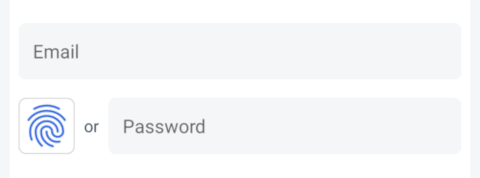

# OwnID Compose Android SDK - Custom Integration

The OwnID Android SDK is a client library offering a secure and passwordless login alternative for your Android applications. It leverages [Passkeys](https://www.passkeys.com) to replace conventional passwords, fostering enhanced authentication methods.

This document describes the way to integrate and use OwnID Compose Android SDK with your identity platform using OwnID Integration component. The alternative way is [Direct Integration](sdk-direct-integration.md).

For more general information about OwnID SDKs, see [OwnID Android SDK](../README.md).

## Table of contents

* [Before You Begin](#before-you-begin)
* [Add Dependency to Gradle File](#add-dependency-to-gradle-file)
* [Enable Java 8 Compatibility in Your Project](#enable-java-8-compatibility-in-your-project)
* [Enable passkey authentication](#enable-passkey-authentication)
* [Create Configuration File](#create-configuration-file)
* [Create OwnID Integration component](#create-ownid-integration-component)
* [Create OwnID Instance](#create-ownid-instance)
* [Implement the Registration Screen](#implement-the-registration-screen)
* [Implement the Login Screen](#implement-the-login-screen)
* [Credential enrollment](#credential-enrollment)
* [Creating custom OwnID Instance](#creating-custom-ownid-instance)
* [Error and Exception Handling](#error-and-exception-handling)

## Before You Begin

Before incorporating OwnID into your Android app, you need to create an OwnID application in [OwnID Console](https://console.ownid.com) and integrate it with your identity platform. For details, see [OwnID documentation](https://docs.ownid.com/introduction).

## Add Dependency to Gradle File

The OwnID Compose Android SDK is available from the Maven Central repository. As long as your app's `build.gradle` file includes `mavenCentral()` as a repository, you can include the OwnID SDK by adding the following to the Gradle file (the latest version is: [](https://search.maven.org/artifact/com.ownid.android-sdk/compose)):

```groovy
implementation "com.ownid.android-sdk:compose:<latest version>"
```

The OwnID Compose Android SDK is built with Android API version 35 and Java 8+, and supports the minimum API version 23.

## Enable Java 8 Compatibility in Your Project

The OwnID SDK requires [Java 8 bytecode](https://developer.android.com/studio/write/java8-support). To enable this feature, add the following to your Gradle file:

```groovy
android {
   compileOptions {
      sourceCompatibility JavaVersion.VERSION_1_8
      targetCompatibility JavaVersion.VERSION_1_8
   }
   kotlinOptions {
      jvmTarget = "1.8"
   }
}
```

## Enable Passkey authentication

The OwnID SDK uses [Passkeys](https://www.passkeys.com) to authenticate users. To enable passkey support for your Android app, you need to:

1. Set the Android package name and signing certificate SHA-256 hash for your OwnID application in the [OwnID Console](https://console.ownid.com) in the Integration > Native Apps section.
2. Associate your application with a website that your application owns using [Digital Asset Links](https://developers.google.com/digital-asset-links) by following this guide: [Add support for Digital Asset Links](https://developer.android.com/training/sign-in/passkeys#add-support-dal).

To obtain the SHA-256 hash of your Android app's signing certificate, use the keytool utility from the Java Development Kit (JDK). Run the following command in a terminal, replacing `[keystore_path]` and `[key_alias]` with your actual keystore path and key alias:
```
keytool -list -v -keystore [keystore_path] -alias [key_alias]
```
You may be prompted for the keystore and key passwords.

## Create Configuration File

The OwnID SDK uses a configuration file in your `assets` folder to configure itself. At a minimum, this JSON configuration file defines the OwnID App Id - the unique identifier of your OwnID application, which you can obtain from the [OwnID Console](https://console.ownid.com). Create `assets/ownIdIntegrationSdkConfig.json` and define the `appId` parameter:
```json
{
   "appId": "gephu342dnff2v" // Replace with your App Id
}
```

For additional configuration options, including logging and UI language, see [Advanced Configuration](sdk-advanced-configuration.md).

## Create OwnID Integration component

To create OwnID Integration component you have to create Kotlin or Java class (for example `CustomIntegration`), make it implement `OwnIdIntegration` interface and implement `register` and `login` methods. You can use this template:

```kotlin
class CustomIntegration(
    private val identityPlatform: IdentityPlatform
) : OwnIdIntegration {

    // Registration parameters in addition to user Login ID (optional)
    class IntegrationRegistrationParameters(val name: String) : RegistrationParameters

    override fun register(
        loginID: String, params: RegistrationParameters?, ownIdResponse: OwnIdResponse, callback: OwnIdCallback<Unit>
    ) {
        // Get registration parameters (optional)
        val name = (params as? IntegrationRegistrationParameters)?.name ?: ""

        val ownIdData = ownIdResponse.payload.data

        // TODO Add code that registers user in your identity platform and set OwnID Data to user profile.
        // On registration success call: callback(Result.success(Unit))
        // on registration failure call: callback(Result.failure(cause /* registration error */))
    }

    override fun login(ownIdResponse: OwnIdResponse, callback: OwnIdCallback<Unit>) {
        val data = ownIdResponse.payload.data

        // TODO Add code that log in user in your identity platform using data
        // On login success call: callback(Result.success(Unit))
        // on login failure call: callback(Result.failure(cause /* login error */))
    }

    companion object {
         const val CONFIGURATION_FILE: String = "ownIdIntegrationSdkConfig.json"

         const val PRODUCT_NAME_VERSION: ProductName = "CustomIntegration/3.4.0"
     }
}
```

## Create OwnID Instance

Before adding OwnID UI to your app screens, you need to use an Android Context and instance of your identity platform to create an instance of OwnID:

See [complete example](../demo/integration-custom/src/main/java/com/ownid/demo/custom/DemoApp.kt)

```kotlin
class MyApplication : Application() {
   override fun onCreate() {
      super.onCreate()

      val identityPlatform = ... // Create instance of your identity platform

      // Create instance of OwnId with CustomIntegration
      OwnId.createInstanceFromFile(
          context = applicationContext,
          configurationAssetFileName = CustomIntegration.CONFIGURATION_FILE,
          productName = CustomIntegration.PRODUCT_NAME_VERSION,
          ownIdIntegration = { CustomIntegration(identityPlatform) }
      )
   }
}
```

> [!NOTE]
>
> The OwnID SDK automatically reads the `ownIdIntegrationSdkConfig.json` configuration file from your `assets` folder and creates an instance that is accessible as `OwnId.getInstanceOrThrow()`. For details about additional customization see [Creating custom OwnID Instance](#creating-custom-ownid-instance).

## Implement the Registration Screen

Using the OwnID Compose SDK to implement passwordless authentication starts by adding an `OwnIdRegisterButton` component to your Registration screen. Your app then waits while the user interacts with OwnID.

```kotlin
val ownIdRegisterViewModel = ownIdViewModel<OwnIdRegisterViewModel>()

OwnIdRegisterButton(
    loginId = emailValue,
    ownIdRegisterViewModel = ownIdRegisterViewModel,
    onReadyToRegister = { loginId ->
        // (Optional) Set the actual login id that was used in OwnID flow into your registration UI 
        if (loginId.isNotBlank()) emailValue = loginId 
    },
    onLogin = { authToken -> /* User is logged in with OwnID. */ },
    onError = { error -> /* Handle 'error' according to your application flow. */ }
)
```

Update your **Create Account** button or equivalent to complete registration with OwnID if the user finished OwnID registration flow:

```kotlin
Button(
    onClick = {
        if (ownIdRegisterViewModel.isReadyToRegister) {
            // Register user with OwnID.
            ownIdRegisterViewModel.register(emailValue, CustomIntegration.IntegrationRegistrationParameters(name.value))
        } else {
            // Register user with a password.
        }
    }
) {
   Text(text = "Create Account")
}
```

Check [complete example](../demo/integration-custom/src/main/java/com/ownid/demo/custom/screen/auth/RegistrationScreen.kt)

 

`OwnIdRegisterButton` component wraps `OwnIdButton` and has the following parameters:
   * `loginId` - Current user login id (e.g., email or phone number).
   * `modifier` - (optional) The modifier to be applied to the `OwnIdRegisterButton`.
   * `ownIdRegisterViewModel` - (optional) An instance of `OwnIdRegisterViewModel`.
   * `onReadyToRegister` - (optional) A function called when the user successfully completes OwnID registration flow.
   * `onLogin` - (optional) A function called when the user successfully completes registration with OwnID and is logged in with OwnID with optional authentication token that can be used to refresh a session.
   * `onResponse` - (optional) A function called at the end of the successful OwnID registration flow with `OwnIdFlowResponse`.
   * `onError` -  (optional) A function called when an error occurs during the OwnID registration process, with `OwnIdException`.
   * `onUndo` - (optional) A function called when the user selects the "Undo" option in the ready-to-register state.
   * `onBusy` - (optional) A function called to notify the busy status during the OwnID registration process.
   * `styleRes` - A style resource reference. Use it to style `OwnIdButton`

For custom integration the functions `onReadyToRegister`, `onLogin`, `onError`, `onUndo`, and `onBusy` will be called.

For additional UI customization, see [Button UI customization](sdk-advanced-configuration.md#button-ui-customization).

## Implement the Login Screen

Similar to the Registration screen, add the passwordless authentication to your application's Login screen by including one of OwnID button variants:

1. Side-by-side button: The `OwnIdButton` that is located on the side of the password input field.
2. Password replacing button: The `OwnIdAuthButton` that replaces password input field.

You can use any of this buttons based on your requirements. 

1. **Side-by-side button**

    Add the following to your Login screen's layout file:

    ```kotlin
    OwnIdLoginButton(
        loginIdProvider = { emailValue },
        onLogin = { authToken ->/* User is logged in with OwnID. */ },
        onError = { error -> /* Handle 'error' according to your application flow. */ }
    )
    ```
    Check [complete example](../demo/integration-custom/src/main/java/com/ownid/demo/custom/screen/auth/LoginScreen.kt#L116)

     

    `OwnIdLoginButton` component wraps `OwnIdButton` and has such parameters:
      * `loginIdProvider` - A function returning the current user login id (e.g., email or phone number).
      * `modifier` - (optional) The modifier to be applied to the `OwnIdLoginButton`.
      * `ownIdLoginViewModel` - (optional) An instance of [OwnIdLoginViewModel].
      * `loginType` - (optional) Login type. Default `OwnIdLoginType.Standard`.
      * `onLogin` - (optional) A function called when the user successfully completes login with OwnID with optional authentication token that can be used to refresh a session.
      * `onResponse` - (optional) A function called at the end of the successful OwnID login flow with `OwnIdFlowResponse`.
      * `onError` -  (optional) A function called when an error occurs during the OwnID login process, with `OwnIdException`.
      * `onBusy` - (optional) A function called to notify the busy status during the OwnID login process.
      * `styleRes` - A style resource reference. Use it to style `OwnIdButton`

    For custom integration the functions `onLogin`, `onError`, and `onBusy` will be called.  
    
1. **Password replacing button**

     Add the following to your Login screen's layout file:

    ```kotlin 
    OwnIdAuthLoginButton(
        loginIdProvider = { emailValue },
        onLogin = { authToken -> /* User is logged in with OwnID. */ },
        onError = { error -> /* Handle 'error' according to your application flow. */ }
    )
    ```
    Check [complete example](../demo/integration-custom/src/main/java/com/ownid/demo/custom/screen/auth/LoginScreen.kt#L148)
  
     

    `OwnIdAuthLoginButton` component wraps `OwnIdAuthButton` and has such parameters:
      * `loginIdProvider` - A function returning the current user login id (e.g., email or phone number).
      * `modifier` - (optional) The modifier to be applied to the `OwnIdLoginButton`.
      * `ownIdLoginViewModel` - (optional) An instance of [OwnIdLoginViewModel].
      * `loginType` - (optional) Login type. Default `OwnIdLoginType.Standard`.
      * `onLogin` - (optional) A function called when the user successfully completes login with OwnID with optional authentication token that can be used to refresh a session.
      * `onResponse` - (optional) A function called at the end of the successful OwnID login flow with `OwnIdFlowResponse`.
      * `onError` -  (optional) A function called when an error occurs during the OwnID login process, with `OwnIdException`.
      * `onBusy` - (optional) A function called to notify the busy status during the OwnID login process.
      * `styleRes` - A style resource reference. Use it to style `OwnIdAuthButton`

    For custom integration the functions `onLogin`, `onError`, and `onBusy` will be called.  

For additional UI customization, see [Button UI customization](sdk-advanced-configuration.md#button-ui-customization).

## Credential enrollment

The credential enrollment feature enables users to enroll credentials outside of the login/registration flows. You can trigger credential enrollment on demand, such as after the user registers with a password.

To trigger credential enrollment, create an instance of `OwnIdEnrollmentViewModel` and call the `enrollCredential` method:

```kotlin
val context = LocalContext.current
val ownIdEnrollmentViewModel = ownIdViewModel<OwnIdEnrollmentViewModel>()

ownIdEnrollmentViewModel.enrollCredential(
    context = context,
    loginIdProvider = ...,
    authTokenProvider = ...
)
```

The `enrollCredential` method requires `loginIdProvider` and `authTokenProvider` functions:
 - `loginIdProvider`: A function that provides the user's login ID. This function should invoke the provided `OwnIdCallback<String>` with the login ID.
 - `authTokenProvider`: A function that provides the user's authentication token. It should invoke the provided `OwnIdCallback<String>` with the authentication token.

```kotlin
/**
 * Type alias for OwnID SDK callback.
 * Called when operation completed with a [Result] value.
 * **Important:** Always called on Main thread.
 */
public typealias OwnIdCallback<T> = Result<T>.() -> Unit
```` 

Optionally, to monitor the status of the last credential enrollment request, you can listen to enrollment events from the StateFlow via `OwnIdEnrollmentViewModel.enrollmentResultFlow`:

```kotlin
ownIdViewModel.enrollmentResultFlow
    .filterNotNull()
    .onEach { Log.i("UserActivity", "enrollmentResult: $it") }
    .launchIn(lifecycleScope)
```

## Creating custom OwnID Instance

To create the OwnID instance you can use a function that reads a configuration file or use one that accepts a JSON string of configuration options directly. The following sections describe this process.

### Option 1: Using Configuration File

You can use the `OwnId.createInstanceFromFile` function to create an OwnID instance using a file with configuration options.

```kotlin
OwnId.createInstanceFromFile(
    context = context, // Android context
    configurationAssetFileName = "ownIdIntegrationSdkConfig.json", // JSON configuration file
    productName = "CustomIntegration/3.1.0", // Used in networks calls as part of `User Agent` string.
    ownIdIntegration = { CustomIntegration(identityPlatform) }
)
```

### Option 2: Using JSON String
You can use the `OwnId.createInstanceFromJson` function to create an OwnID instance using a JSON string with configuration options.

```kotlin
OwnId.createInstanceFromJson(
    context = context, // Android context
    configurationJson = """{"appId": "gephu342dnff2v"}""", // String with configuration in JSON format. Use your App Id
    productName = "CustomIntegration/3.1.0", // Used in networks calls as part of `User Agent` string.
    ownIdIntegration = { CustomIntegration(identityPlatform) }
)
```

## Error and Exception Handling

The OwnID SDK provides special classes that you can use to add error and exception handling to your application.

The general `OwnIdException` class represents top-level class for errors and exceptions that may happen in the flow of the OwnID SDK. Check its definition in code [OwnIdException](/sdk/core/src/main/java/com/ownid/sdk/exception/OwnIdException.kt):

In addition, the following classes are special exceptions that can occur in the flow of the OwnID SDK:
* `class OwnIdFlowCanceled(val step: String) : OwnIdException("User canceled OwnID ($step) flow.")` - Exception that occurs when user cancelled OwnID flow. Usually application can ignore this error.

* `class OwnIdUserError(val code: String, val userMessage: String, message: String, cause: Throwable? = null) : OwnIdException(message, cause)` - Error that is intended to be reported to end user. The `userMessage` string is localized based on [OwnID SDK language](sdk-advanced-configuration.md/#ownid-sdk-language) and can be used as an error message for user.

* `class OwnIdIntegrationError(message: String, cause: Throwable? = null) : OwnIdException(message, cause)` - General error for wrapping identity platform errors OwnID integrates with.