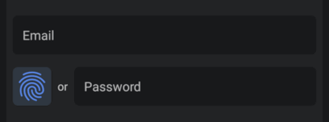

# OwnID Core Android SDK - Direct Integration

The OwnID Android SDK is a client library offering a secure and passwordless login alternative for your Android applications. It leverages [Passkeys](https://www.passkeys.com) to replace conventional passwords, fostering enhanced authentication methods.

This document describes the way to directly integrate and use OwnID Core Android SDK with your identity platform. The alternative way is [Custom Integration](sdk-custom-integration.md).

For more general information about OwnID SDKs, see [OwnID Android SDK](../README.md).

## Table of contents

* [Before You Begin](#before-you-begin)
* [Add Dependency to Gradle File](#add-dependency-to-gradle-file)
* [Enable Java 8 Compatibility in Your Project](#enable-java-8-compatibility-in-your-project)
* [Enable passkey authentication](#enable-passkey-authentication)
* [Create Configuration File](#create-configuration-file)
* [Create OwnID Instance](#create-ownid-instance)
* [Implement the Registration Screen](#implement-the-registration-screen)
   + [Add OwnID UI](#add-ownid-ui)
   + [Listen to Events from OwnID Register View Model](#listen-to-events-from-ownid-register-view-model)
* [Implement the Login Screen](#implement-the-login-screen)
   + [Add OwnID UI](#add-ownid-ui-1)
   + [Listen to Events from OwnID Login View Model](#listen-to-events-from-ownid-login-view-model)
* [Tooltip](#tooltip)
* [Credential enrollment](#credential-enrollment)
* [Creating custom OwnID Instance](#creating-custom-ownid-instance)
* [Error and Exception Handling](#error-and-exception-handling)

## Before You Begin

Before incorporating OwnID into your Android app, you need to create an OwnID application in [OwnID Console](https://console.ownid.com) and integrate it with your identity platform. For details, see [OwnID documentation](https://docs.ownid.com/introduction).

## Add Dependency to Gradle File

The OwnID Core Android SDK is available from the Maven Central repository. As long as your app's `build.gradle` file includes `mavenCentral()` as a repository, you can include the OwnID SDK by adding the following to the Gradle file (the latest version is: [](https://search.maven.org/artifact/com.ownid.android-sdk/core)):

```groovy
implementation "com.ownid.android-sdk:core:<latest version>"
```

The OwnID Core Android SDK is built with Android API version 34 and Java 8+, and supports the minimum API version 23.

## Enable Java 8 Compatibility in Your Project

The OwnID SDK requires [Java 8 bytecode](https://developer.android.com/studio/write/java8-support). To enable this feature, add the following to your Gradle file:

```groovy
android {
   compileOptions {
      sourceCompatibility JavaVersion.VERSION_1_8
      targetCompatibility JavaVersion.VERSION_1_8
   }
   kotlinOptions {
      jvmTarget = "1.8"
   }
}
```

## Enable Passkey authentication

The OwnID SDK uses [Passkeys](https://www.passkeys.com) to authenticate users. To enable passkey support for your Android app, you need to:

1. Set the Android package name and signing certificate SHA-256 hash for your OwnID application in the [OwnID Console](https://console.ownid.com) in the Integration > Native Apps section.
2. Associate your application with a website that your application owns using [Digital Asset Links](https://developers.google.com/digital-asset-links) by following this guide: [Add support for Digital Asset Links](https://developer.android.com/training/sign-in/passkeys#add-support-dal).

## Create Configuration File

The OwnID SDK uses a configuration file in your `assets` folder to configure itself. At a minimum, this JSON configuration file defines the OwnID App Id - the unique identifier of your OwnID application, which you can obtain from the [OwnID Console](https://console.ownid.com). Create `assets/ownIdIntegrationSdkConfig.json` and define the `appId` parameter:
```json
{
   "appId": "gephu342dnff2v" // Replace with your App Id
}
```

For additional configuration options, including logging and UI language, see [Advanced Configuration](sdk-advanced-configuration.md).

## Create OwnID Instance

Before adding OwnID UI to your app screens, you need to use an Android Context and configuration file to create an instance of OwnID. Product name used in networks calls as part of `User Agent` string:

```kotlin
class MyApplication : Application() {
   override fun onCreate() {
      super.onCreate()

      OwnId.createInstanceFromFile(
          context = applicationContext,
          configurationAssetFileName = "ownIdIntegrationSdkConfig.json",
          productName = "DirectIntegration/3.4.0"
        ) 
   }
}
```

> [!NOTE]
>
> The OwnID SDK automatically reads the `ownIdIntegrationSdkConfig.json` configuration file from your `assets` folder and creates an instance that is accessible as `OwnId.getInstanceOrThrow(OwnId.DEFAULT_INSTANCE_NAME)` or a short version `OwnId.getInstanceOrThrow()`. For details about additional customization see [Creating custom OwnID Instance](#creating-custom-ownid-instance).

## Implement the Registration Screen

Using the OwnID SDK to implement passwordless authentication with Native flow starts by adding an `OwnIdButton` view to your Registration screen's layout file. Your app then waits for events while the user interacts with OwnID.

### Add OwnID UI

Add the passwordless authentication to your application's Registration screen by including the `OwnIdButton` view to your Registration screen's layout file:

```xml
<com.ownid.sdk.view.OwnIdButton
    android:id="@+id/own_id_register"
    android:layout_width="wrap_content"
    android:layout_height="0dp"
    app:loginIdEditText="@id/et_fragment_create_email" />
```

 

`OwnIdButton` is an Android [ConstraintLayout](https://developer.android.com/reference/androidx/constraintlayout/widget/ConstraintLayout) view that contains OwnID button - customized [ImageView](https://developer.android.com/reference/android/widget/ImageView) and [TextView](https://developer.android.com/reference/android/widget/TextView) with "or" text. The OwnID button ImageView is always square in size, recommended to use height to not less `40dp`. It's recommended to use [ConstraintLayout](https://developer.android.com/training/constraint-layout) and position `OwnIdButton` to the start on password EditText with top constraint set to the top and bottom to the bottom of Password EditText. If you want to put `OwnIdButton` to the end on password EditText, set attribute `app:widgetPosition="end"` for `OwnIdButton`.

Define the `loginIdEditText` attribute to reference the [EditText](https://developer.android.com/reference/android/widget/EditText) widget that correspond to the Login ID field of your Registration screen. Including these attribute simplifies the way the SDK obtains the user's Login ID. If you want your code to provide the user's Login ID to the SDK instead of using the view attribute, see [Advanced Configuration: Provide Login ID to OwnID](sdk-advanced-configuration.md#provide-login-id-to-ownid).

For additional `OwnIdButton` UI customization see [Advanced Configuration: Button UI customization](sdk-advanced-configuration.md#button-ui-customization).

### Listen to Events from OwnID Register View Model

Now that you have added the OwnID UI to your screen, you need to listen to registration events that occur when the user interacts with OwnID. First, create an instance of `OwnIdRegisterViewModel` in your Fragment or Activity:

```kotlin
class MyRegistrationFragment : Fragment() {
    private val ownIdViewModel: OwnIdRegisterViewModel by ownIdViewModel()
}
```

Within that Fragment or Activity, insert code that attaches a `OwnIdButton` view to the `OwnIdRegisterViewMode` and listens to OwnID Register flow events:

```kotlin
class MyRegistrationFragment : Fragment() {
    
    private val ownIdViewModel: OwnIdRegisterViewModel by ownIdViewModel()

    override fun onViewCreated(view: View, savedInstanceState: Bundle?) {
        super.onViewCreated(view, savedInstanceState)

        ownIdViewModel.attachToView(view.findViewById(R.id.own_id_register))

        ownIdViewModel.flowEvents.observe(viewLifecycleOwner) { ownIdFlowEvent ->
            when (ownIdFlowEvent) {
                // Event when OwnID is busy processing request
                is OwnIdRegisterFlow.Busy -> {
                    // (Optional) Show busy status 'ownIdFlowEvent.isBusy' according to your application UI 
                }
                
                // Event when user successfully finishes OwnID registration flow
                is OwnIdRegisterFlow.Response -> {
                    when (ownIdFlowEvent.payload.type) { 
                        OwnIdPayload.Type.Registration -> { 
                            if (ownIdFlowEvent.loginId.isNotBlank()) {
                                // Set the actual login Id that was used in OwnID flow into your registration UI
                            }

                            // 1. Update your submit button to perform registration with OwnID data from this event
                            // 2. Collect any addition registration data from user
                            // 3. On submit button click register user with your identity platform and 
                            //    set OwnId Data (ownIdFlowEvent.payload.data) to user profile
                        }

                        OwnIdPayload.Type.Login -> { 
                            // Login user with your identity platform using data 
                            // from this event (ownIdFlowEvent.payload.data)
                        }
                    }
                }

                // Event when user select "Undo" option
                OwnIdRegisterFlow.Undo -> { 
                    // Update submit button on click listener to run registration without OwnID data. 
                }

                // Event when an error happened during OwnID flow 
                is OwnIdRegisterFlow.Error -> {
                    // Handle error 'ownIdFlowEvent.cause' according to your application flow
                }
            }
        }
    }
}
```

## Implement the Login Screen

The process of implementing your Login screen is very similar to the one used to implement the Registration screen - add an OwnId UI to your Login screen. Your app then waits for events while the user interacts with OwnID.

### Add OwnID UI

Similar to the Registration screen, add the passwordless authentication to your application's Login screen by including one of OwnID button variants:

1. Side-by-side button: The `OwnIdButton` that is located on the side of the password input field.
2. Password replacing button: The `OwnIdAuthButton` that replaces password input field.

You can use any of this buttons based on your requirements. 

1. **Side-by-side button**

    Add the following to your Login screen's layout file:

    ```xml
    <com.ownid.sdk.view.OwnIdButton
        android:id="@+id/own_id_login"
        android:layout_width="wrap_content"
        android:layout_height="0dp"
        app:loginIdEditText="@id/et_fragment_login_email" />
    ```

     

    `OwnIdButton` is an Android [ConstraintLayout](https://developer.android.com/reference/androidx/constraintlayout/widget/ConstraintLayout) view that contains OwnID button - customized [ImageView](https://developer.android.com/reference/android/widget/ImageView) and [TextView](https://developer.android.com/reference/android/widget/TextView) with "or" text. The OwnID button ImageView is always square in size, recommended to use height to not less `40dp`. It's recommended to use [ConstraintLayout](https://developer.android.com/training/constraint-layout) and put `OwnIdButton` to the end on password EditText with top constraint set to the top and bottom to the bottom of Password EditText.

    Define the `loginIdEditText` attribute to reference the [EditText](https://developer.android.com/reference/android/widget/EditText) widget that correspond to the Login ID field of your Login screen. Including these attribute simplifies the way the SDK obtains the user's Login ID. If you want your code to provide the user's Login ID to the SDK instead of using the view attribute, see [Advanced Configuration: Provide Login ID to OwnID](sdk-advanced-configuration.md#provide-login-id-to-ownid).

    For additional `OwnIdButton` UI customization see [Advanced Configuration: Button UI customization](sdk-advanced-configuration.md#button-ui-customization).
    
1. **Password replacing button**

     Add the following to your Login screen's layout file:

    ```xml
    <com.ownid.sdk.view.OwnIdAuthButton
        android:id="@+id/own_id_login"
        android:layout_width="0dp"
        android:layout_height="wrap_content"
        app:loginIdEditText="@id/et_fragment_login_email" />
    ```

     

    `OwnIdAuthButton` is an Android [ConstraintLayout](https://developer.android.com/reference/androidx/constraintlayout/widget/ConstraintLayout) view that contains OwnID button - customized [MaterialButton](https://developer.android.com/reference/com/google/android/material/button/MaterialButton) and [CircularProgressIndicator](https://developer.android.com/reference/com/google/android/material/progressindicator/CircularProgressIndicator). It's recommended to use [ConstraintLayout](https://developer.android.com/training/constraint-layout) and position `OwnIdAuthButton` below Login ID EditText with start and end constraint set to the start and end of Login ID EditText.

    Define the `loginIdEditText` attribute to reference the [EditText](https://developer.android.com/reference/android/widget/EditText) widget that correspond to the Login ID field of your Registration screen. Including these attribute simplifies the way the SDK obtains the user's Login ID. If you want your code to provide the user's Login ID to the SDK instead of using the view attribute,  see [Advanced Configuration: Provide Login ID to OwnID](sdk-advanced-configuration.md#provide-login-id-to-ownid).

    For additional `OwnIdAuthButton` UI customization see [Advanced Configuration: Button UI customization](sdk-advanced-configuration.md#button-ui-customization).

### Listen to Events from OwnID Login View Model

Now that you have added the OwnID UI to your screen, you need to listen to login events that occur as the user interacts with OwnID. First, create an instance of `OwnIdLoginViewModel` in your Fragment or Activity:

```kotlin
class MyLoginFragment : Fragment() {
    private val ownIdViewModel: OwnIdLoginViewModel by ownIdViewModel()
}
```

Within that Fragment or Activity, insert code that attaches a `OwnIdButton` or `OwnIdAuthButton` view to the `OwnIdLoginViewModel` and listens to OwnID Login flow events:

```kotlin
class MyLoginFragment : Fragment() {
    
private val ownIdViewModel: OwnIdLoginViewModel by ownIdViewModel()

    override fun onViewCreated(view: View, savedInstanceState: Bundle?) {
        super.onViewCreated(view, savedInstanceState)

        ownIdViewModel.attachToView(view.findViewById(R.id.own_id_login))

        ownIdViewModel.events.observe(viewLifecycleOwner) { ownIdFlowEvent ->
            when (ownIdFlowEvent) {
                // Event when OwnID is busy processing request
                is OwnIdLoginFlow.Busy -> { 
                    // (Optional) Show busy status 'ownIdFlowEvent.isBusy' according to your application UI
                }
                
                // Event when OwnID logs in user
                is OwnIdLoginFlow.Response -> {
                    // Login user with your identity platform using data from this event (ownIdFlowEvent.payload.data)
                }

                // Event when an error happened during OwnID flow 
                is OwnIdLoginFlow.Error -> {
                    // Handle 'ownIdFlowEvent.cause' according to your application flow
                }
            }
        }
    }
}
```

## Tooltip

The OwnID SDK's `OwnIdButton` can show a Tooltip with text "Sign in with fingerprint" / "Register with fingerprint". The OwnID Tooltip view is attached to `OwnIdButton` view lifecycle. For login the Tooltip appears every time the `OwnIdButton` view is `onResume` state and hides on `onPause` state. For registration the Tooltip appears when Login ID "EditText" view contains valid Login ID address, and follows the same `onResume`/`onPause` state logic.

 

`OwnIdButton` view has parameters to specify tooltip text appearance, tooltip background color (default value `#FFFFFF`, default value-night: `#2A3743`), tooltip border color (default value `#D0D0D0`, default value-night: `#2A3743`) and tooltip position `top`/`bottom`/`start`/`end`/`none` (default `none`). You can change them by setting values in view attributes:

```xml
<com.ownid.sdk.view.OwnIdButton
    app:tooltipTextAppearance="@style/OwnIdButton.TooltipTextAppearance.Default"
    app:tooltipBackgroundColor="@color/com_ownid_sdk_color_tooltip_background"
    app:tooltipBorderColor="@color/com_ownid_sdk_color_tooltip_border"
    app:tooltipPosition="bottom"/>
```

or via `style` attribute. First defile a style:

```xml
<resources>
    <style name="OwnIdButton.TooltipTextAppearance.Default" parent="@style/TextAppearance.AppCompat" />

    <style name="OwnIdButton.Custom" parent="">
        <item name="tooltipTextAppearance">@style/OwnIdButton.TooltipTextAppearance.Default</item>
        <item name="tooltipBackgroundColor">@color/com_ownid_sdk_color_tooltip_background</item>
        <item name="tooltipBorderColor">@color/com_ownid_sdk_color_tooltip_border</item>
        <item name="tooltipPosition">bottom</item>
    </style>
</resources>
```

and then set it in view attribute:

```xml
<com.ownid.sdk.view.OwnIdButton
    style="@style/OwnIdButton.Custom" />
```

## Credential enrollment

The credential enrollment feature enables users to enroll credentials outside of the login/registration flows. You can trigger credential enrollment on demand, such as after the user registers with a password.

To trigger credential enrollment, create an instance of `OwnIdEnrollmentViewModel` and call the `enrollCredential` method:

```kotlin
class UserActivity : AppCompatActivity() { 
    private val ownIdViewModel: OwnIdEnrollmentViewModel by ownIdViewModel()

    override fun onCreate(savedInstanceState: Bundle?) {
        super.onCreate(savedInstanceState)
       
        ownIdViewModel.enrollCredential(
            context = this@UserActivity,
            loginIdProvider = ...,
            authTokenProvider = ...
        )
    }
}
```

The `enrollCredential` method requires `loginIdProvider` and `authTokenProvider` functions:
 - `loginIdProvider`: A function that provides the user's login ID. This function should invoke the provided `OwnIdCallback<String>` with the login ID.
 - `authTokenProvider`: A function that provides the user's authentication token. It should invoke the provided `OwnIdCallback<String>` with the authentication token.

```kotlin
/**
 * Type alias for OwnID SDK callback.
 * Called when operation completed with a [Result] value.
 * **Important:** Always called on Main thread.
 */
public typealias OwnIdCallback<T> = Result<T>.() -> Unit
```` 

Optionally, to monitor the status of the last credential enrollment request, you can listen to enrollment events from the StateFlow via `OwnIdEnrollmentViewModel.enrollmentResultFlow`:

```kotlin
ownIdViewModel.enrollmentResultFlow
    .filterNotNull()
    .onEach { Log.i("UserActivity", "enrollmentResult: $it") }
    .launchIn(lifecycleScope)
```

## Creating custom OwnID Instance

To create the OwnID instance you can use a function that reads a configuration file or use one that accepts a JSON string of configuration options directly. The following sections describe this process.

### Option 1: Using Configuration File

You can use the `OwnId.createInstanceFromFile` function to create an OwnID instance using a file with configuration options.

```kotlin
OwnId.createInstanceFromFile(
    context = context, // Android context
    configurationAssetFileName = "ownIdIntegrationSdkConfig.json", // JSON configuration file
    productName = "DirectIntegration/3.1.0" // Used in networks calls as part of `User Agent` string.
)
```

### Option 2: Using JSON String
You can use the `OwnId.createInstanceFromJson` function to create an OwnID instance using a JSON string with configuration options.

```kotlin
OwnId.createInstanceFromJson(
    context = context, // Android context
    configurationJson = """{"appId": "gephu342dnff2v"}""", // String with configuration in JSON format. Use your App Id
    productName = "DirectIntegration/3.1.0" // Used in networks calls as part of `User Agent` string.
)
```

## Error and Exception Handling

The OwnID SDK provides special classes that you can use to add error and exception handling to your application.

The general `OwnIdException` class represents top-level class for errors and exceptions that may happen in the flow of the OwnID SDK. Check its definition in code [OwnIdException](/sdk-core/src/main/java/com/ownid/sdk/exception/OwnIdException.kt):

In addition, the following classes are special exceptions that can occur in the flow of the OwnID SDK:
* `class OwnIdFlowCanceled(val step: String) : OwnIdException("User canceled OwnID ($step) flow.")` - Exception that occurs when user cancelled OwnID flow. Usually application can ignore this error.

* `class OwnIdUserError(val code: String, val userMessage: String, message: String, cause: Throwable? = null) : OwnIdException(message, cause)` - Error that is intended to be reported to end user. The `userMessage` string is localized based on [OwnID SDK language](sdk-advanced-configuration.md/#ownid-sdk-language) and can be used as an error message for user.