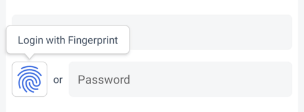
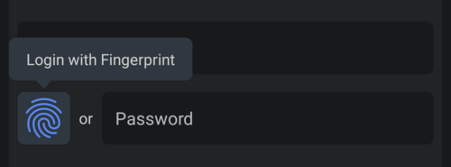

# OwnID Firebase-Android SDK
The OwnID Firebase-Android SDK allows you to integrate OwnID passwordless logins with Email/Password-based [Firebase Authentication](https://firebase.google.com/docs/auth) in an Android application. The SDK is a client library written in Kotlin that provides a simple way to add the "Skip Password" feature to the registration and login screens of your native app. The SDK is packaged as an Android library (.aar) that is available from the Maven Central repository. For more general information about OwnID SDKs, see [OwnID Android SDK](../README.md).

## Table of contents
* [Before You Begin](#before-you-begin)
* [Add Dependency to Gradle File](#add-dependency-to-gradle-file)
* [Enable Java 8 Compatibility in Your Project](#enable-java-8-compatibility-in-your-project)
* [Create Configuration File](#create-configuration-file)
* [Implement the Registration Screen](#implement-the-registration-screen)
   + [Add OwnID UI](#add-ownid-ui)
   + [Listen to Events from OwnID Register View Model](#listen-to-events-from-ownid-register-view-model)
      - [Calling the register() Function](#calling-the-register-function)
* [Implement the Login Screen](#implement-the-login-screen)
   + [Add OwnID UI](#add-ownid-ui-1)
   + [Listen to Events from OwnID Login View Model](#listen-to-events-from-ownid-login-view-model)
* [Tooltip](#tooltip)
* [Error and Exception Handling](#error-and-exception-handling)
* [Advanced Configuration](#advanced-configuration)
   + [Logging Events](#logging-events)
   + [OwnID environment](#ownid-environment)
   + [OwnID Web App language](#ownid-web-app-language)
   + [Redirection URI Alternatives](#redirection-uri-alternatives)
   + [Custom OwnID SDK Instances](#custom-ownid-sdk-instances)
   + [Provide Email to OwnID](#provide-email-to-ownid)
   + [Button UI customization](#button-ui-customization)
   + [Custom view](#custom-view)

---

## Before You Begin
Before incorporating OwnID into your Android app, you need to create an OwnID application and integrate it with your Firebase project. For details, see [OwnID Firebase Integration Basics](firebase-integration-basics.md).

You should also ensure you have done everything to [add Firebase authentication to your Android project](https://firebase.google.com/docs/android/setup).

## Add Dependency to Gradle File
The OwnID Firebase-Android SDK is available from the Maven Central repository. As long as your app's `build.gradle` file includes `mavenCentral()` as a repository, you can include the OwnID SDK by adding the following to the Gradle file (the latest version is: [](https://github.com/OwnID/ownid-android-sdk)):
```groovy
implementation "com.ownid.android-sdk:firebase:<latest version>"
```
The OwnID Firebase-Android SDK is built with Android API version 32 and Java 8, and supports the minimum API version 23.

## Enable Java 8 Compatibility in Your Project
The OwnID SDK requires [Java 8 bytecode](https://developer.android.com/studio/write/java8-support). To enable this feature, add the following to your Gradle file:

```groovy
android {
    compileOptions {
        sourceCompatibility JavaVersion.VERSION_1_8
        targetCompatibility JavaVersion.VERSION_1_8
    }
    kotlinOptions {
        jvmTarget = "1.8"
    }
}
```

## Create Configuration File
When the application starts, the OwnID SDK automatically reads a configuration file in your `assets` folder and creates a default instance that is accessible as `OwnId.firebase`. At a minimum, this JSON configuration file defines the OwnID App Id - the unique identifier of your OwnID application, which you can obtain from the [OwnID Console](https://console.ownid.com). Create `assets/ownIdFirebaseSdkConfig.json` and define the `app_id` parameter:
```json
{
  "app_id": "4tb9nt6iaur0zv"
}
```

For additional configuration options, including redirection URI, logging and OwnID Web App language, see [Advanced Configuration](#advanced-configuration).

## Implement the Registration Screen
Using the OwnID SDK to implement the Skip Password feature starts by adding an OwnIdButton view to your Registration screen's layout file. Your app then waits for events while the user interacts with OwnID.

**Important:** When a user registers with OwnID, a random password is generated and set for the user's Firebase account.

### Add OwnID UI
You add the Skip Password feature to your application's Registration screen by including the OwnIdButton view. Simply add the following to your Registration screen's layout file:

```xml
<com.ownid.sdk.view.OwnIdButton
    android:id="@+id/own_id_register"
    android:layout_width="wrap_content"
    android:layout_height="0dp"
    app:emailEditText="@id/et_fragment_create_email" />
```
Check [complete example](../demo-firebase/src/main/res/layout/fragment_create.xml)

 

OwnIdButton is an Android [LinearLayout](https://developer.android.com/reference/android/widget/LinearLayout) view that contains OwnID "Skip Password" customized [ImageView](https://developer.android.com/reference/android/widget/ImageView) and [TextView](https://developer.android.com/reference/android/widget/TextView) with "or" text. The OwnID "Skip Password" ImageView is always square in size with its height as primary value and width always equals height. It's recommended to use [ConstraintLayout](https://developer.android.com/training/constraint-layout) and put OwnIdButton to the start on password EditText with top constraint set to the top and bottom to the bottom of Password EditText. If you whant to put OwnIdButton to the end on password EditText, set attribute `app:widgetPosition="end"` for OwnIdButton.

Define the `emailEditText` attribute to reference the [EditText](https://developer.android.com/reference/android/widget/EditText) widget that correspond to the email fields of your Registration screen. Including these attribute simplifies the way the SDK obtains the user's email. If you want your code to provide the user's email to the SDK instead of using the view attribute, see [Provide Email to OwnID](#provide-email-to-ownid).

For additional OwnIdButton UI customization see [Button UI customization](#button-ui-customization).

### Listen to Events from OwnID Register View Model
Now that you have added the OwnID UI to your screen, you need to listen to registration events that occur when the user interacts with OwnID. First, create an instance of `OwnIdRegisterViewModel` in your Fragment or Activity, passing in an OwnID Firebase instance as the argument:

<details open>
<summary>Kotlin</summary>

```kotlin
class MyRegistrationFragment : Fragment() {
    private val ownIdViewModel: OwnIdRegisterViewModel by ownIdViewModel(OwnId.firebase)
}
```
</details>

<details>
<summary>Java</summary>

```java
class MyRegistrationFragment extends Fragment {
    private OwnIdRegisterViewModel ownIdViewModel;

    @Override
    public void onViewCreated(@NonNull View view, @Nullable Bundle savedInstanceState) {
        super.onViewCreated(view, savedInstanceState);

        ownIdViewModel = OwnIdViewModelFactory.getOwnIdViewModel(
            this, OwnIdRegisterViewModel.class, OwnIdFirebaseFactory.getDefault()
        );
    }
}
```
</details>

Within that Fragment or Activity, insert code that sets a ViewModel to the OwnIdButton view and listens to OwnID Register events:

<details open>
<summary>Kotlin</summary>

Check [complete example](../demo-firebase/src/main/java/com/ownid/demo/firebase/ui/fragment/CreateFragment.kt)

```kotlin
class MyRegistrationFragment : Fragment() {
    private val ownIdViewModel: OwnIdRegisterViewModel by ownIdViewModel(OwnId.firebase)

    override fun onViewCreated(view: View, savedInstanceState: Bundle?) {
        super.onViewCreated(view, savedInstanceState)

        view.findViewById<OwnIdButton>(R.id.own_id_register).setViewModel(ownIdViewModel, viewLifecycleOwner)
        
        ownIdViewModel.events.observe(viewLifecycleOwner) { ownIdEvent ->
            when (ownIdEvent) {
                // Event when OwnID is busy processing request
                is OwnIdRegisterEvent.Busy -> { /* Show busy status 'ownIdEvent.isBusy' according to your application UI */  }
                
                // Event when user successfully finishes Skip Password in OwnID Web App
                is OwnIdRegisterEvent.ReadyToRegister -> {
                    // Obtain user's email before calling the register() function.
                    ownIdViewModel.register(email)
                }

                // Event when user select "Undo" option in ready-to-register state
                OwnIdRegisterEvent.Undo -> { /* */}

                // Event when OwnID creates Firebase account and logs in user
                is OwnIdRegisterEvent.LoggedIn -> { /* User is logged in with OwnID. Use 'ownIdEvent.authType' to get type of authentication that was used during OwnID flow.*/ }

                // Event when OwnID returns an error
                is OwnIdRegisterEvent.Error -> {
                    // Handle error 'ownIdEvent.cause' according to your application flow
                }
            }
        }
    }
}
```
</details>

<details>
<summary>Java</summary>

Check [complete example](../demo-firebase-java/src/main/java/com/ownid/demo/firebase/ui/fragment/CreateFragment.java)

```java
class MyRegistrationFragment extends Fragment {
    private OwnIdRegisterViewModel ownIdViewModel;

    @Override
    public void onViewCreated(@NonNull View view, @Nullable Bundle savedInstanceState) {
        super.onViewCreated(view, savedInstanceState);

        ownIdViewModel = OwnIdViewModelFactory.getOwnIdViewModel(
            this, OwnIdRegisterViewModel.class, OwnIdFirebaseFactory.getDefault()
        );

        ((OwnIdButton) view.findViewById(R.id.own_id_register)).setViewModel(ownIdViewModel, getViewLifecycleOwner());

        ownIdViewModel.getEvents().observe(getViewLifecycleOwner(), (Observer<OwnIdRegisterEvent>) ownIdEvent -> {
            // Event when OwnID is busy processing request
            if (ownIdEvent instanceof OwnIdRegisterEvent.Busy) {
                // Show busy status '((OwnIdRegisterEvent.Busy) ownIdEvent).isBusy()' according to your application UI
            }
            
            // Event when user successfully finishes Skip Password in OwnID Web App
            if (ownIdEvent instanceof OwnIdRegisterEvent.ReadyToRegister) {
                // Obtain user's email before calling the register() function.
                ownIdViewModel.register(email);
            }

            // Event when user select "Undo" option in ready-to-register state
            if (ownIdEvent instanceof OwnIdRegisterEvent.Undo) {
            }

            // Event when OwnID creates Firebase account and logs in user
            if (ownIdEvent instanceof OwnIdRegisterEvent.LoggedIn) {
                // User is logged in with OwnID. Use '((OwnIdRegisterEvent.LoggedIn) ownIdEvent).getAuthType()' to get type of authentication that was used during OwnID flow. 
            }

            // Event when OwnID returns an error
            if (ownIdEvent instanceof OwnIdRegisterEvent.Error) {
                // Handle error '((OwnIdRegisterEvent.Error) ownIdEvent).getCause()' according to your application flow
            }
        });
    }
}
```
</details>

#### Calling the register() Function
The OwnID `OwnIdRegisterViewModel.register()` function must be called in response to the `ReadyToRegister` event. This function eventually calls the standard Firebase function `createUserWithEmailAndPassword(String email, String password)` to register the user in Firebase, so you do not need to call this Firebase function yourself.

## Implement the Login Screen
The process of implementing your Login screen is very similar to the one used to implement the Registration screen - add an OwnIdButton view to your Login screen. Your app then waits for events while the user interacts with OwnID.

### Add OwnID UI
Similar to the Registration screen, you add Skip Password feature to your application's Login screen by including the OwnIdButton. Add the following to your Login screen's layout file:

```xml
<com.ownid.sdk.view.OwnIdButton
    android:id="@+id/own_id_login"
    android:layout_width="wrap_content"
    android:layout_height="0dp"
    app:emailEditText="@id/et_fragment_login_email" />
```
Check [complete example](../demo-firebase/src/main/res/layout/fragment_login.xml)

 

OwnIdButton is an Android [LinearLayout](https://developer.android.com/reference/android/widget/LinearLayout) view that contains OwnID "Skip Password" customized [ImageView](https://developer.android.com/reference/android/widget/ImageView) and [TextView](https://developer.android.com/reference/android/widget/TextView) with "or" text. The OwnID "Skip Password" ImageView is always square in size with its height as primary value and width always equals height. It's recommended to use [ConstraintLayout](https://developer.android.com/training/constraint-layout) and put OwnIdButton to the end on password EditText with top constraint set to the top and bottom to the bottom of Password EditText.

Define the `emailEditText` attribute to reference the [EditText](https://developer.android.com/reference/android/widget/EditText) widget that correspond to the email fields of your Login screen. Including these attribute simplifies the way the SDK obtains the user's email. If you want your code to provide the user's email to the SDK instead of using the view attribute, see [Provide Email to OwnID](#provide-email-to-ownid).

For additional OwnIdButton UI customization see [Button UI customization](#button-ui-customization).

### Listen to Events from OwnID Login View Model
Now that you have added the OwnID UI to your screen, you need to listen to login events that occur as the user interacts with OwnID. First, create an instance of `OwnIdLoginViewModel` in your Fragment or Activity, passing in an OwnID Firebase instance as the argument:

<details open>
<summary>Kotlin</summary>

```kotlin
class MyLoginFragment : Fragment() {
    private val ownIdViewModel: OwnIdLoginViewModel by ownIdViewModel(OwnId.firebase)
}
```
</details>

<details>
<summary>Java</summary>

```java
class MyLoginFragment extends Fragment {
    private OwnIdLoginViewModel ownIdViewModel;

    @Override
    public void onViewCreated(@NonNull View view, @Nullable Bundle savedInstanceState) {
        super.onViewCreated(view, savedInstanceState);

        ownIdViewModel = OwnIdViewModelFactory.getOwnIdViewModel(
            this, OwnIdLoginViewModel.class, OwnIdFirebaseFactory.getDefault()
        );
    }
}
```
</details>

Within that Fragment or Activity, insert code that sets a ViewModel to the OwnIdButton view and listens to OwnID login events:

<details open>
<summary>Kotlin</summary>

Check [complete example](../demo-firebase/src/main/java/com/ownid/demo/firebase/ui/fragment/LoginFragment.kt)

```kotlin
class MyLoginFragment : Fragment() {
    private val ownIdViewModel: OwnIdLoginViewModel by ownIdViewModel(OwnId.firebase)

    override fun onViewCreated(view: View, savedInstanceState: Bundle?) {
        super.onViewCreated(view, savedInstanceState)

        view.findViewById<OwnIdButton>(R.id.own_id_login).setViewModel(ownIdViewModel, viewLifecycleOwner)

        ownIdViewModel.events.observe(viewLifecycleOwner) { ownIdEvent ->
            when (ownIdEvent) {
                // Event when OwnID is busy processing request
                is OwnIdLoginEvent.Busy -> { /* Show busy status 'ownIdEvent.isBusy' according to your application UI */  }
                
                //Event when user who previously set up OwnID logs in with Skip Password
                is OwnIdLoginEvent.LoggedIn -> { /* User is logged in with OwnID. Use 'ownIdEvent.authType' to get type of authentication that was used during OwnID flow.*/ }

                // Event when OwnID returns an error
                is OwnIdLoginEvent.Error -> {
                    // Handle error 'ownIdEvent.cause' according to your application flow
                }
            }
        }
    }
}
```
</details>


<details>
<summary>Java</summary>

Check [complete example](../demo-firebase-java/src/main/java/com/ownid/demo/firebase/ui/fragment/LoginFragment.java)

```java
class MyLoginFragment extends Fragment {
    private OwnIdLoginViewModel ownIdViewModel;

    @Override
    public void onViewCreated(@NonNull View view, @Nullable Bundle savedInstanceState) {
        super.onViewCreated(view, savedInstanceState);

        ownIdViewModel = OwnIdViewModelFactory.getOwnIdViewModel(
            this, OwnIdLoginViewModel.class, OwnIdFirebaseFactory.getDefault()
        );

        ((OwnIdButton) view.findViewById(R.id.own_id_login)).setViewModel(ownIdViewModel, getViewLifecycleOwner());

        ownIdViewModel.getEvents().observe(getViewLifecycleOwner(), (Observer<OwnIdLoginEvent>) ownIdEvent -> {
            // Event when OwnID is busy processing request
            if (ownIdEvent instanceof OwnIdLoginEvent.Busy) {
                // Show busy status '((OwnIdLoginEvent.Busy) ownIdEvent).isBusy()' according to your application UI
            }
            
            //Event when user who previously set up OwnID logs in with Skip Password
            if (ownIdEvent instanceof OwnIdLoginEvent.LoggedIn) {
                // User is logged in with OwnID. Use '((OwnIdLoginEvent.LoggedIn) ownIdEvent).getAuthType()' to get type of authentication that was used during OwnID flow. 
            }

            // Event when OwnID returns an error
            if (ownIdEvent instanceof OwnIdLoginEvent.Error) {
                // Handle error '((OwnIdRegisterEvent.Error) ownIdEvent).getCause()' according to your application flow
            }
        });
    }
}
```
</details>

## Tooltip
The OwnID SDK by default shows a Tooltip with text "Login with Fingerprint". The OwnID Tooltip view is attached to OwnIDButton view lifecycle. For Login the Tooltip appears every time the OwnIdButton view is "onResume" state and hides on "onPause" state. For Registration the Tooltip appears when email "EditText" view contains valid email address, and follows the same "onResume"/"onPause" state logic.

 

OwnIdButton view has parameters to specify  Tooltip text appearance and three configurable parameters: tooltip background color (default value `#FFFFFF`, default value-night: `#2A3743`), tooltip border color (default value `#D0D0D0`, default value-night: `#2A3743`) and tooltip position `top`/`bottom`/`start`/`end`/`none` (default `top`). You can change them by setting values in view attributes:

```xml
<com.ownid.sdk.view.OwnIdButton
    app:tooltipTextAppearance="@style/OwnIdButton.TooltipTextAppearance.Default"
    app:tooltipBackgroundColor="@color/com_ownid_sdk_color_tooltip_background"
    app:tooltipBorderColor="@color/com_ownid_sdk_color_tooltip_border"
    app:tooltipPosition="top"/>
```

or via `style` attribute. First defile a style:

```xml
<resources>
    <style name="OwnIdButton.TooltipTextAppearance.Default" parent="@style/TextAppearance.AppCompat" />

    <style name="OwnIdButton.Default" parent="">
        <item name="tooltipTextAppearance">@style/OwnIdButton.TooltipTextAppearance.Default</item>
        <item name="tooltipBackgroundColor">@color/com_ownid_sdk_color_tooltip_background</item>
        <item name="tooltipBorderColor">@color/com_ownid_sdk_color_tooltip_border</item>
        <item name="tooltipPosition">top</item>
    </style>
</resources>
```

and then set it in view attribute:

```xml
<com.ownid.sdk.view.OwnIdButton
    style="@style/OwnIdButton.Custom" />
```

## Error and Exception Handling
The OwnID SDK provides special classes that you can use to add error and exception handling to your application.

The general `OwnIdException` class represents errors and exceptions that should not happen in the normal flow of the OwnID SDK. The following is its definition:
```kotlin
/**
 * General exception used by this SDK.
 *
 * @param message   Text message describing the reason for the exception
 * @param cause     Original exception that is wrapped in [OwnIdException]
 */
class OwnIdException (message: String, cause: Throwable? = null) : Exception(message, cause)
```
In addition, the following classes are special exceptions that can occur in the normal flow of the OwnID SDK:
* `class ServerError(message: String) : OwnIdException(message)` - Represents an OwnID server error. Includes a text message from the server.
* `class FlowCanceled : OwnIdException("User canceled OwnID flow")` - Exception that occurs when user cancelled any OwnID flow. It also can happen when OwnID SDK has wrong redirect uri set.
* `class FlowExpired : OwnIdException("OwnID flow expired")` - Exception that occurs when OwnID flow expires.
* `class EmailInvalid : OwnIdException("The email address is badly formatted")` - Errors during OwnID flow when user email address is badly formatted.
* `class NoOwnIdResponse : OwnIdException("No OwnIdResponse available. Login or Register flow must be run first")` - Error returned when calling `register` before the user completes the OwnID Registration flow in the OwnID Web App.
* `class NoResultLauncherSet : OwnIdException("No ActivityResultLauncher set")` - Error returned when user clicks on OwnID UI but ViewModel was no `ActivityResultLauncher` set.

## Advanced Configuration

### Logging Events
OwnID SDK has a Logger that is used to log its events. The default OwnID Logger implementation, `OwnIdLogger.DefaultLogger()`, simply relays logs to `android.util.Log`.
To use a custom Logger, implement the `OwnIdLogger.Logger` interface, then specify your custom logger class instance and/or custom tag using the `init` method:

<details open>
<summary>Kotlin</summary>

```kotlin
OwnIdLogger.set("Custom-Tag", CustomLogger())
```
</details>

<details>
<summary>Java</summary>

```java
OwnIdLogger.set("Custom-Tag", new CustomLogger());
```
</details>

By default, logging is **disabled**. To enable logging, set `OwnIdLogger.enabled = true`. It is highly recommended that you disable logging in production builds.

Logging can also be enabled from the configuration file `assets/ownIdFirebaseSdkConfig.json` by adding the optional `enable_logging` parameter:

```json
{
  "app_id": "4tb9nt6iaur0zv",
  "enable_logging": true
}
```

### OwnID environment
By default, the OwnID uses production environment for `app_id` specified in configuration. You can set different environment. Possible options are: `uat`, `staging` and `dev`. Use `env` key in configuration json to specify required non-production environment:

```json
{
  "app_id": "4tb9nt6iaur0zv",
  "env": "uat"
}
```

### OwnID Web App language
By default, the OwnID Web App is launched with a language TAGs list (well-formed [IETF BCP 47 language tag](https://developer.mozilla.org/en-US/docs/Web/HTTP/Headers/Accept-Language)) based on the device locales set by the user in the Android system. You can override this behavior and set the Web App language list manually. There are two ways to do so:

1. Set Web App language list Producer - function that returns the language TAGs list for the OwnID Web App.

   <details open>
   <summary>Kotlin</summary>

   ```kotlin
   OwnIdButton.setWebAppLanguageListProducer { listOf("en") }
   ```
   </details>

   <details>
   <summary>Java</summary>

   ```java
   OwnIdButton.setWebAppLanguageListProducer(() -> Collections.singletonList("en"));
   ```
   </details>

2. Set Web App language list directly:

   <details open>
   <summary>Kotlin</summary>

   ```kotlin
   OwnIdButton.setWebAppLanguageList(listOf("en"))
   ```
   </details>

   <details>
   <summary>Java</summary>

   ```java
   OwnIdButton.setWebAppLanguageList(Collections.singletonList("en"));
   ```
   </details>

If more than one method of specifying the language TAGs is used, the SDK uses the following priority: the list from the Producer take precedence if it's not empty, then the language list is used if it's not empty, and then the list from device locales is used.

### Redirection URI Alternatives
The redirection URI determines where the user lands once they are done using their browser to interact with the OwnID web app. Because it needs to capture this redirect, the OwnID SDK must be registered with the Android OS as a handler of the URI. By default OwnID SDK use redirection URI as `{applicationId}://ownid/redirect/` whereas the `applicationId` represent the [Android application Id](https://developer.android.com/studio/build/configure-app-module#set-application-id).
```xml
<activity
    android:name="com.ownid.sdk.internal.OwnIdRedirectActivity"
    android:exported="true"
    android:launchMode="singleTask">

    <intent-filter>
        <action android:name="android.intent.action.VIEW" />
        <category android:name="android.intent.category.DEFAULT" />
        <category android:name="android.intent.category.BROWSABLE" />
        <data
            android:host="ownid"
            android:path="/redirect/"
            android:scheme="${applicationId}" />
    </intent-filter>
</activity>
```
By doing so OwnID SDK assumes that the `applicationId` will match the value returned by [Context.getPackageName()](https://developer.android.com/reference/kotlin/android/content/Context#getpackagename). If the `applicationId` cannot be used as URI scheme ([see requirements](https://datatracker.ietf.org/doc/html/rfc3986#section-3.1)) an error will be thrown `IllegalArgumentException: Application package name (applicationId) cannot be used as URI scheme: https://datatracker.ietf.org/doc/html/rfc3986#section-3.1`. In this case, use custom redirection uri.

If you want to avoid using a default redirection URI, you can add an intent-filter for OwnIdRedirectActivity with required custom url to your AndroidManifest.xml file:

```xml
<activity
    android:name="com.ownid.sdk.internal.OwnIdRedirectActivity"
    android:exported="true"
    android:launchMode="singleTask"
    tools:node="replace">

    <intent-filter>
        <action android:name="android.intent.action.VIEW"/>
        <category android:name="android.intent.category.DEFAULT"/>
        <category android:name="android.intent.category.BROWSABLE"/>
        <data
                android:host="myhost"
                android:scheme="com.myapp.demo" />
    </intent-filter>
</activity>
```
And specify this custom url in OwnID configuration with key `redirection_uri`:
```json
{
   "app_id": "4tb9nt6iaur0zv",
   "redirection_uri": "com.myapp.demo://myhost"
}
```

In other cases, you might need to use an HTTPS redirection URI instead of a custom scheme. It is highly recommended that you secure HTTPS redirects by configuring the redirection URI as a verified [Android App Links](https://developer.android.com/training/app-links/index.html).

```xml
<activity
    android:name="com.ownid.sdk.internal.OwnIdRedirectActivity"
    android:exported="true"
    android:launchMode="singleTask"
    tools:node="replace">

    <intent-filter android:autoVerify="true">
        <action android:name="android.intent.action.VIEW"/>
        <category android:name="android.intent.category.DEFAULT"/>
        <category android:name="android.intent.category.BROWSABLE"/>
        <data android:scheme="https"
              android:host="demo.myapp.com"
              android:path="/ownid"/>
    </intent-filter>
</activity>
```

### Custom OwnID SDK Instances
By default, the OwnID SDK creates a instance on application startup using the `assets/ownIdFirebaseSdkConfig.json` configuration file and the default Firebase Auth instance `Firebase.auth` and Firebase Firestore instance `Firebase.firestore`. This is done by means of the Android [App Startup](https://developer.android.com/topic/libraries/app-startup) library. It is possible to disable this default, then use an SDK function to create the custom instance. When creating the custom instance, you can use a function that reads a configuration file or use one that accepts a JSON string of configuration options directly. The following sections describe this process. 

#### Disabling automatic default instance creation 
If you want to use a function to create a custom instance, first add the following to your manifest file to disable the automatic creation of an instance:

```xml
<provider
    android:name="androidx.startup.InitializationProvider"
    android:authorities="${applicationId}.androidx-startup"
    android:exported="false"
    tools:node="merge">
    <meta-data android:name="com.ownid.sdk.OwnIdFirebaseInitializer"
              tools:node="remove" />
</provider>
```

#### Option 1: Custom Instance Using Configuration File
Once you have modified the manifest file to disable the default instance creation, you can use the `OwnId.createFirebaseInstance` function to create a custom instance. This function reads from a configuration file when creating the instance. If you would prefer to pass the configuration options using a JSON string, see [Custom Instance Using JSON String](#option-2-custom-instance-using-json-string).

<details open>
<summary>Kotlin</summary>

```kotlin
OwnId.createFirebaseInstance(
    context: Context, // Android context
    configurationAssetFileName: String = OwnIdFirebase.DEFAULT_CONFIGURATION_FILE_NAME, // JSON configuration file
    firebaseAuth: FirebaseAuth = Firebase.auth, // Firebase Auth instance
    firestore: FirebaseFirestore = Firebase.firestore,  // Firebase Firestore instance
    instanceName: InstanceName = OwnIdFirebase.DEFAULT_INSTANCE_NAME // Instance name
): OwnIdFirebase
```

To get a default OwnID SDK instance, use `OwnId.firebase`. To get an instance with a custom name, use `OwnId.firebase(instanceName)`.
</details>

<details>
<summary>Java</summary>

```java
OwnIdFirebaseFactory.createInstance(
    context: Context, // Android context
    configurationAssetFileName: String = OwnIdFirebase.DEFAULT_CONFIGURATION_FILE_NAME, // JSON configuration file
    firebaseAuth:FirebaseAuth = Firebase.auth, // Firebase Auth instance
    firestore: FirebaseFirestore = Firebase.firestore,  // Firebase Firestore instance
    instanceName:InstanceName = OwnIdFirebase.DEFAULT_INSTANCE_NAME // Instance name
): OwnIdFirebase
```

To get a default OwnID SDK instance, use `OwnIdFirebaseFactory.getDefault()`. To get an instance with a custom name, use `OwnIdFirebaseFactory.getInstance(instanceName)`.
</details>

#### Option 2: Custom Instance Using JSON String
Once you have modified the manifest file to [disable the automatic creation of an instance](#disabling-automatic-default-instance-creation), you can use the `OwnId.createFirebaseInstanceFromJson` function to create a custom instance that is configured using a JSON string. If you would to prefer to create a custom instance using a configuration file, see [Custom Instance Using Configuration File](#option-1-custom-instance-using-configuration-file).

<details open>
<summary>Kotlin</summary>

```kotlin
OwnId.createFirebaseInstanceFromJson(
    context: Context, // Android context
    configurationJson: String, // String with configuration in JSON format
    firebaseAuth: FirebaseAuth = Firebase.auth, // Firebase Auth instance
    firestore: FirebaseFirestore = Firebase.firestore,  // Firebase Firestore instance
    instanceName: InstanceName = OwnIdFirebase.DEFAULT_INSTANCE_NAME // Instance name
): OwnIdFirebase
```

To get a default OwnID SDK instance, use `OwnId.firebase`. To get an instance with a custom name, use `OwnId.firebase(instanceName)`.
</details>

<details>
<summary>Java</summary>

```java
OwnIdFirebaseFactory.createInstanceFromJson(
    context: Context, // Android context
    configurationJson: String, // String with configuration in JSON format
    firebaseAuth: FirebaseAuth = Firebase.auth, // Firebase Auth instance
    firestore: FirebaseFirestore = Firebase.firestore,  // Firebase Firestore instance
    instanceName: InstanceName = OwnIdFirebase.DEFAULT_INSTANCE_NAME // Instance name
): OwnIdFirebase
```

To get a default OwnID SDK instance, use `OwnIdFirebaseFactory.getDefault()`. To get an instance with a custom name, use `OwnIdFirebaseFactory.getInstance(instanceName)`.
</details>

### Provide Email to OwnID
If you decide not to use the `emailEditText` view attribute to identify your email EditText widget, but still want the SDK to obtain value from this widget, you have two options.

You can set the email EditText in code:

```java
OwnIdButton.setEmailView(/* Email EditText reference */)
```

Or you can set a Producer - a function that returns the email as a String:

<details open>
<summary>Kotlin</summary>

```kotlin
OwnIdButton.setEmailProducer { /* Code that returns email as String */ }
```
</details>

<details>
<summary>Java</summary>

```java
OwnIdButton.setEmailProducer(()->{ /* Code that returns email as String */ });
```
</details>

If more than one method of specifying the email is used, the SDK uses the following priority: values from the Producer take precedence, then view reference value set from code, and then value from the `emailEditText` attribute.

### Button UI customization
OwnIdButton view has parameter to specify icon variant `fingerprint` (default) or `faceId`, widget position at `start` (default) or `end` of password input field, show/hide "or" text, to specify "or" text appearance and three configurable color parameters: background color (default value `#FFFFFF`, default value-night: `#2A3743`), border color (default value `#D0D0D0`, default value-night: `#2A3743`) and icon color (default value `#0070F2`, default value-night: `#2E8FFF`). You can change them by setting values in view attributes:

```xml
<com.ownid.sdk.view.OwnIdButton
    app:backgroundColor="@color/com_ownid_sdk_color_button_background"
    app:iconColor="@color/com_ownid_sdk_color_button_icon"
    app:borderColor="@color/com_ownid_sdk_color_button_border"
    app:orTextAppearance="@style/OwnIdButton.OrTextAppearance.Default"
    app:showOr="true"
    app:variant="fingerprint"
    app:widgetPosition="start" />
```

or via `style` attribute. First defile a style:

```xml
<resources>
    <style name="OwnIdButton.OrTextAppearance.Custom" parent="@style/OwnIdButton.OrTextAppearance.Default">
        <item name="android:textColor">#000000</item>
    </style>

    <style name="OwnIdButton.Custom" parent="OwnIdButton.Default">
        <item name="widgetPosition">start</item>
        <item name="variant">fingerprint</item>
        <item name="showOr">true</item>
        <item name="orTextAppearance">@style/OwnIdButton.OrTextAppearance.Custom</item>
        <item name="backgroundColor">@color/com_ownid_sdk_color_button_background</item>
        <item name="borderColor">@color/com_ownid_sdk_color_button_border</item>
        <item name="iconColor">@color/com_ownid_sdk_color_button_icon</item>
    </style>
</resources>
```

and then set it in view attribute:

```xml
<com.ownid.sdk.view.OwnIdButton
    style="@style/OwnIdButton.Custom" />
```

### Custom view
You can use any Android [View](https://developer.android.com/reference/android/view/View) to run OwnID Login/Registration flow.  Use method `attachToView` from `OwnIdLoginViewModel` and `OwnIdRegisterViewModel` to enable OwnID functionality for the view:

See [complete example](../demo-firebase/src/main/java/com/ownid/demo/firebase/ui/fragment/LoginCustomFragment.kt)

```kotlin
OwnIdViewModel.attachToView(
    view, // An instance of view to attach OwnID functionality to
    owner, // The view LifecycleOwner
    emailProducer, // (optional) a function that returns user's email as a String
    languageProducer, // (optional) a function that returns language TAGs list for OwnID Web App
    onOwnIdResponse  // (optional) a function that will be called when OwnID has OwnIdResponse. Use it to update view UI.
)
```